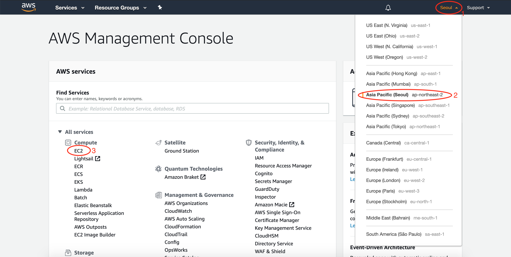
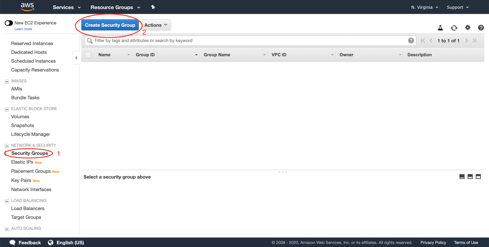
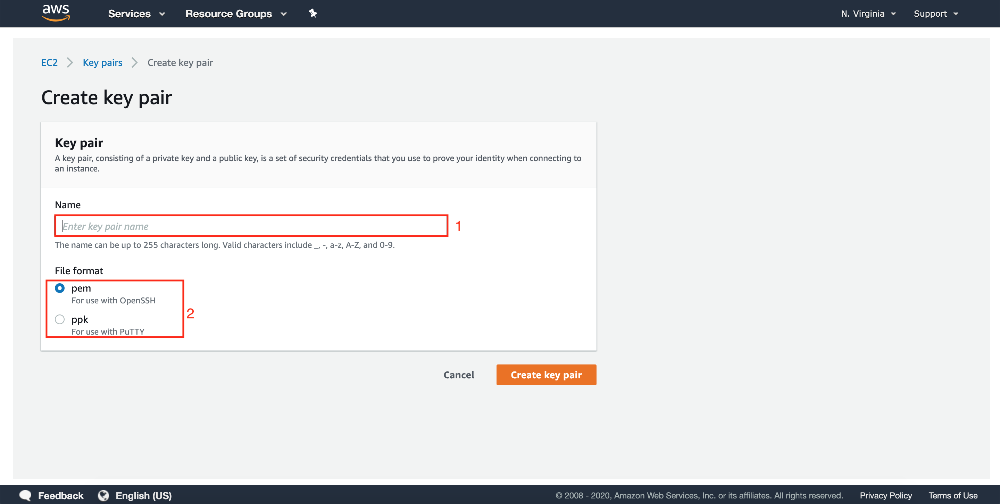
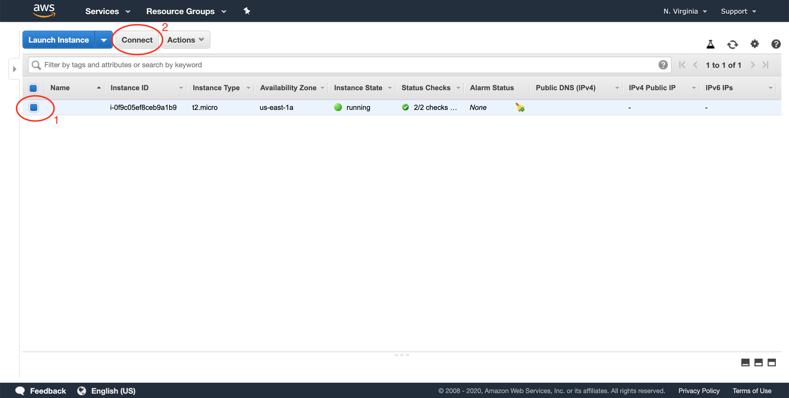

AWS EC2 설치법
================

Amazon Web Service 에서 제공하는 EC2 인스턴스 설치법에 대한 문서이다.

 

### 설치 가이드

계정이 없으면 [Amazon Web Service](https://aws.amazon.com/) 사이트에 접속해서 계정을 만든다.
학생은 75 USD 크레딧을 주므로 [AWS
Educate](https://aws.amazon.com/education/awseducate/)으로 접속해 가입하고 사용할 수
있다.

AWS에 로그인을 하면 위에 그림처럼 보일꺼다. 먼저 우측 상단에 내가 설치하고자 하는 리젼을 정해 클릭한다. 그리고 중간에
`EC2`를 클릭해 페이지로 이동한다.

 

EC2 콘솔 페이지로 이동한 후 좌측에 `NETWORK & SECURITY` 부분에 `Security Groups` (보안그룹)을
클릭한 후 새로 만든다. 보안 그룹은 인스턴스와의 연결에 필요한 가상 방화벽 역활을 한다고 생각하면 된다.

 

`Security group` 이름을 적은 후 밑에 `Add Rule`을 클릭해 필요한 규칙을 추가하면 된다. 여기서
`Source`에 `Anywhere`를 지정하면 어디서든지 해당 인스턴스와 트래피을 주고 받을 수 있다. 이 외에도 특정한 IP
주소를 정할 수 있고 현재 사용하는 장소의 IP 주소로도 설정할 수 있다.

 

`NETWORK & SECURITY` 아래 `Key Pairs`를 클릭한 후 새로운 키페어를 생성한다. 만약 윈도우 운영체제를
사용하면 `ppk`를 클릭한 후 키페어를 생성시킨다. 키페어를 받은 후 원하는 폴더에 보관하거나 `.ssh` 폴더에
보관한다.

 

`INSTANCES` 아래 `Instances`를 클릭한 후 `Launch Instance`를 클릭한다. 그리고 어느 서버를
원하는지 찾아보면 된다. 여기서는 Ubuntu 18.04 서버를 사용할 것이다. 그리고 필요한 조건에 맞게 설정을 하면
된다.

 

본인이 원하는 설정을 고른 후 `Review and Launch`를 누른다. 그러면 아까 설정한 키페어를 사용하거나 새로 만들어서
클릭한 후 `Launch Instance`를 눌러 EC2 인스턴스를 생성시킨다.

 

인스턴스를 생성시킨 후 원하는 인스턴스를 클린한 후 위에 `Connect`를 눌러 나온 가이드를 따라 접속하면 된다. 윈도우
운영체제를 사용하는 경우 `PuTTY`를 사용하여 접속해야 하므로
[여기](https://docs.aws.amazon.com/AWSEC2/latest/UserGuide/putty.html)를
클릭해 사용법을 보면된다.

맥 운영체제를 사용하는 경우 시작전에 키페어가 있는 폴더로 이동한다. 그리고 처음 접속할때는 권한 모드를 바꾼 후
`Step 3`를 통해 접속한다.

    # Step 1
    cd path/to/keypair
    
    # Step 2
    chmod 400 키페어.pem
    
    # Step 3
    ssh -i "키페어.pem"  ubuntu@ec2-xxx-xxx-xxx-xxx.ap-northeast-2.compute.amazonaws.com
