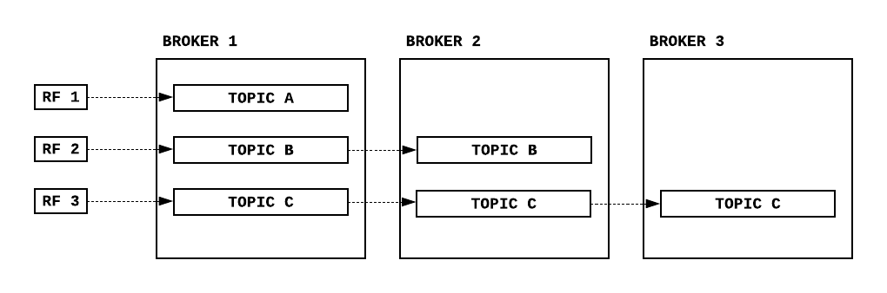

# Apache Kafka (Part II)

공식 문서에서 [Kafka](https://kafka.apache.org/downloads) 를 다운로드 후 실행시키면 아래와 같이 폴더들이 생성될 것이다. 자세한 설치 방법은 구글링을 통해 참조하면 된다.

```
kafka
├── bin
│   └── windows
├── config
├── libs
└── site-docs
```

먼저 `bin` 폴더에 들어간 후 아래 코드를 실행할 것이다.

<br>

## 토픽 생성

실행:
```
./kafka-topics.sh \
    --create \
    --bootstrap-server localhost:9092 \
    --replication-factor 1 \
    --partitions 3 \
    --topic topicA
```

결과:

```
Created topic topicA.
```



**replication-factor (RF)** : 복제할 토픽 개수

## Producer

실행:

```
./kafka-console-producer.sh \
    --bootstrap-server localhost:9092 \
    --topic topicA
```

결과:

```
> Hello World
> How are you?
> I'm fine thank you.
```

## Consumer

실행:

```
./kafka-console-consumer.sh \
    --bootstrap-server localhost:9092 \
    --topic topicA \
    --from-beginning
```

결과:

```
Hello World
How are you?
I'm fine thank you.
```

## Consumer Group

실행:

```
./kafka-console-consumer.sh \
    --bootstrap-server localhost:9092 \
    --topic topicA \
    --group groupA \
    --from-beginning
```

결과:

```
I'm fine thank you.
Hello World
How are you?
```

컨슈머로 데이터를 불렀을 대 위에 나온 결과 순서가 다른 이유는 파티션이 3개 있어서 그렇다. 컨슈머는 데이터를 불러올때 offset 의 순서를 따르지 파티션의 순서를 따라서 불러오지 않는다. 그 이후로 프로듀서가 데이터를 추가하고 컨슈머로 데이터를 읽으면 마지막으로 불러진 offset 이후의 데이터들을 가져온다. 그 이유는 파티션들은 각 컨슈머 그룹이 마지막으로 기록한 offset 정보를 가지고 있기 때문이다.

<br>

**컨슈머 그룹 리스트**

실행:

```
./kafka-consumer-groups.sh \
    --bootstrap-server localhost:9092 \
    --list
```

결과:

```
groupA
```

<br>

**컨슈머 그룹 상태 확인**

실행:

```
./kafka-consumer-groups.sh \
    --bootstrap-server localhost:9092 \
    --group groupA \
    --describe
```

결과:

```
Consumer group 'groupA' has no active members.

GROUP       TOPIC       PARTITION  CURRENT-OFFSET  LOG-END-OFFSET  LAG  CONSUMER-ID     HOST    CLIENT-ID
groupA      topicA      1          4               4               0    -               -       -
groupA      topicA      0          3               3               0    -               -       -
groupA      topicA      2          3               3               0    -               -       -
```

**CURRENT-OFFSET** : 컨슈머가 읽은 offset 위치

**LOG-END-OFFSET** : 파티션의 마지막 offset 

**LOG** : 컨슈머 랙 ( lag = log-end-offset - current-offset )

<br>

그 외에도 offset 정보를 `--reset-offsets` 을 통해 초기화 할 수 있다.

<br>

# Java + Kafka

**Maven Dependencies**

```
<dependency>
    <groupId>org.apache.kafka</groupId>
    <artifactId>kafka-clients</artifactId>
    <version>2.7.0</version>
</dependency>
```

**KProducer.java**

```
public class KProducer {
    public static void main(String[] args) {
        Properties config = new Properties();
        config.put(ProducerConfig.BOOTSTRAP_SERVERS_CONFIG, "localhost:9092");
        config.put(ProducerConfig.KEY_SERIALIZER_CLASS_CONFIG, StringSerializer.class.getName());
        config.put(ProducerConfig.VALUE_SERIALIZER_CLASS_CONFIG, StringSerializer.class.getName());
        config.put(ProducerConfig.ACKS_CONFIG, "all");

        KafkaProducer<String, String> producer = new KafkaProducer<>(config);

        for(int i = 0; i < 20; i++) {
            String sendData = "Data " + i;
            ProducerRecord<String, String> producerRecord = new ProducerRecord<>("topicA", sendData);
            
            // Key 를 통해 데이터 보낼 파티션 지정 
            // ProducerRecord<String, String> producerRecordWithKey = new ProducerRecord<>("topicA", Integer.toString(i), sendData);
            
            // 자세한 내용은 ProducerRecord.class 확인
            
            try {
                producer.send(producerRecord);
                Thread.sleep(1000);
            } catch (Exception e) {
                e.printStackTrace();
            }
        }
    }
}
```

**KConsumer.java**

```
public class KConsumer {
    public static void main(String[] args) {
        Properties config = new Properties();
        config.put(ConsumerConfig.BOOTSTRAP_SERVERS_CONFIG, "localhost:9092");
        config.put(ConsumerConfig.GROUP_ID_CONFIG, "groupA");
        config.put(ConsumerConfig.KEY_DESERIALIZER_CLASS_CONFIG, StringDeserializer.class.getName());
        config.put(ConsumerConfig.VALUE_DESERIALIZER_CLASS_CONFIG, StringDeserializer.class.getName());

        // 자동커밋 조건
        config.put(ConsumerConfig.ENABLE_AUTO_COMMIT_CONFIG, false);
        // config.put(ConsumerConfig.ENABLE_AUTO_COMMIT_CONFIG, true);
        // config.put(ConsumerConfig.AUTO_COMMIT_INTERVAL_MS_CONFIG, 6000);

        // Rebalance 컨디션 확인
        // 컨슈머는 3초마다 브로커 중 1대에다 heartbeat 전송
        // 10초 세션 타임아웃 시간안에 heartbeat 를 못받으면 해당 컨슈머는 죽은거로 처리
        // 파티션과 컨슈머들이 rebalance 됨
        // 이때 컨슈머는 작업이 중단됨
        // * RebalanceListener() 사용해도됨
        config.put(ConsumerConfig.HEARTBEAT_INTERVAL_MS_CONFIG, 3000);
        config.put(ConsumerConfig.SESSION_TIMEOUT_MS_CONFIG, 10000);


        KafkaConsumer<String, String> consumer = new KafkaConsumer<>(config);
        consumer.subscribe(Arrays.asList("topicA"));

        try {
            while(true) {
                ConsumerRecords<String, String> consumerRecord = consumer.poll(Duration.ofSeconds(1));
                for(ConsumerRecord<String, String> record: consumerRecord) {
                    System.out.println(record.value());
                }
                // 동기 커밋
                consumer.commitSync();

                // 비동기 커밋
                // consumer.commitAsync();
            }
        } catch(WakeupException wakeupException) {
            wakeupException.printStackTrace();
        } catch(CommitFailedException commitFailedException) {
            // 커밋 오류로 재시도 구현
            System.out.println("Commit Error - try again");
        } finally {
            // 갑자기 오류났을 때를 대비해서 마지막 offset을 커밋한 후 종료
            consumer.commitSync();
            consumer.close();
        }
    }
}
```