# Apache Kafka (Part I)

공식 사이트에 따르면 Apache Kafka는 오픈소스 분산 데이터 스트리밍 플랫폼이다. 쉽게 말해 대용량 데이터를 효율적으로 처리해주는 플랫폼이다. 이전에는 데이터를 전송할때 어플리케이션과의 관계가 명확해야 했다. A번 어플리케이션의 데이터들은 B번 어플리케이션이 처리한다. 그러나 카프카는 이 관계를 느슨하게 (Loose Coupling) 해주어 어플리케이션간의 관계를 간접적으로 해주게 되었다.

Apache Kafaka는 Pub/Sub 모델을 사용한다.

    1. Producer
    2. Kafka Cluster:
        - Broker
        - Topic
        - Partition
        - Zookeeper
    3. Consumer Group
        - Consumer

**Producer** : 프로듀서는 데이터를 브로커로 보내는 역할

**Kafka Cluseter** : 카프카 서버의 묶음

**Broker** : 카프카 서버

**Topic** : 데이터를 종류를 분리해주는 역할

**Partition** : 각 토픽 안에서 데이터를 분산 처리하는 단위

**Zookeeper** : 카프카의 클러스터 노드 등 메타데이터를 관리해주는 분산 코디네이터 시스템

**Consumer Group** : 컨슈머들의 집합

**Consumer** : 데이터를 받아오는 역할

<br>

## Kafka Architecture

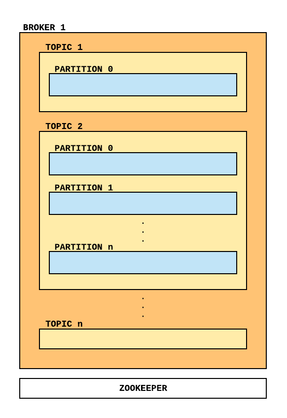

카프카 서버는 Zookeeper와 함께 사용된다. 위에 그림처럼 각 브로커 내부에는 토픽들이 존재한다. 토픽은 데이터 종류를 분리해주는 역할을 하므로 사용자가 환경에 따라 정해주면 된다. 예를 들면 유저의 활동 로그와 위치정보 로그를 저장하려고 하면 activity_log와 location_log로 토픽을 분류해 데이터를 처리할 수 있다. 그리고 각 토픽에는 최소 하나의 파티션이 존재하고 상황에 따라 파티션 수를 늘릴 수 있다. 파티션 수를 증가시키면 대용량 데이터를 분산시켜 저장할 수 있고 컨슈머 수도 늘릴 수 있어 분산 처리가 가능해진다. 마지막으로 브로커 수도 늘릴 수 있으며 브로커들의 집합을 카프카 클러스터로 작업할 수 있다.


### **Topic & Partition**

그럼 카프카 토픽은 어떻게 데이터를 받을까?

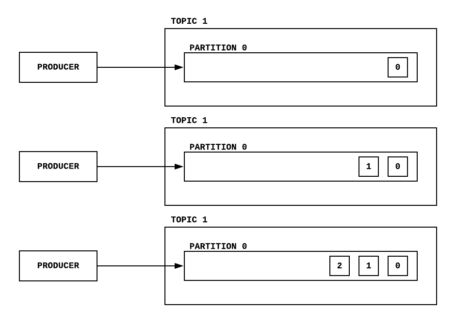

먼저 파티션이 1개가 있다고 하면 프로듀서가 데이터를 보내는 순서대로 들어가진다. 그리고 이런 데이터들은 offset이라고 하는 순서를 부여받는다. Offset은 나중에 컨슈머로부터 어디까지 데이터를 읽었는지 등 위치 정보를 알려준다. 이러한 데이터들은 순차적으로 컨슈머를 통해 읽혀진다.

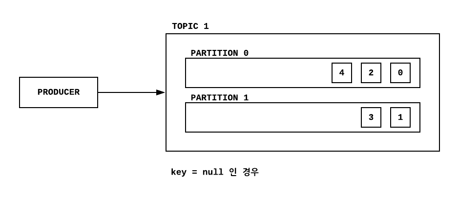

만약 파티션이 2개 이상 존재하면 키값을 통해 데이터들이 들어가진다. 키값이 없이 NULL이면 Round-Robin을 통해 데이터들이 각 파티션에 들어가진다. 반대로 키값이 있으면 hash 값을 통해 해당 파티션에 데이터들이 들어가진다.

토픽에서 파티션 수를 늘릴 수 있지만 **줄일 수는 없다**. 위에 그림에서 보이듯이 파티션에 들어간 데이터들은 컨슈머가 뽑아서 읽어도 지워지지 않는다. 그러므로 다양한 컨슈머 그룹을 통해 데이터 처리가 가능하다. 예를 들면 A 토픽에 들어간 데이터들을 한 곳에서는 검색엔진이 뽑아가 실시간 처리할 수 있고 다른 한 곳에서는 데이터들을 저장하는 작업을 할 수 있다. 파티션에 저장된 데이터들은 사용자가 사이즈 또는 시간을 설정해 삭제하게 지정할 수 있다.


### **Broker**

카프카를 사용해 안전하고 효율적으로 데이터를 분사처리 하려면 최소한 3개의 브로커가 있어야 한다. 이유를 찾아보니 주키퍼의 쿼럼 (quorum) 속성 때문에 홀수로 정해야 한다고 한다... 이렇게 구성된 브로커들중 1대에만 데이터들이 저장되고 (Leader) 나머지 2대에는 복제가 된다 (Followers). 이 과정을 ISR (In Sync Replica)라고 한다. 그럼 왜 이런 과정이 필요할까?

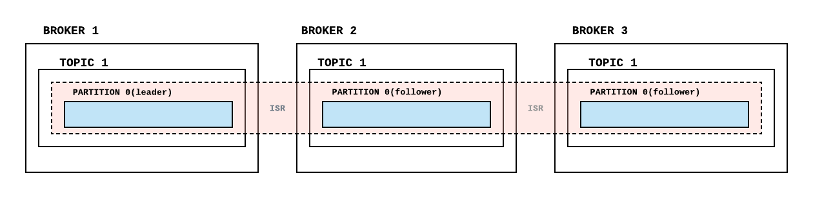

위에 그림을 보면 브로커 1에 파티션이 리더 역할을 하고 있으며 프로듀서는 리더에 데이터를 보낸다. 그리고 브로커 2와 3에 데이터들이 복제된다.

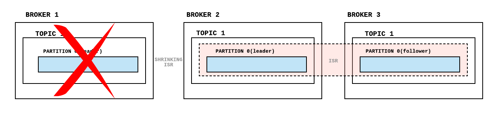

만약 브로커 1이 고장났다고 하면 리더 역확을 다른 브로커로 이전이 된다. 이 과정을 Shrinking ISR 이라고 한다. Zookeeper가 어느 브로커가 고장났는지 파악하고 다른 브로커로 리더를 이전한다. 

**예시.**

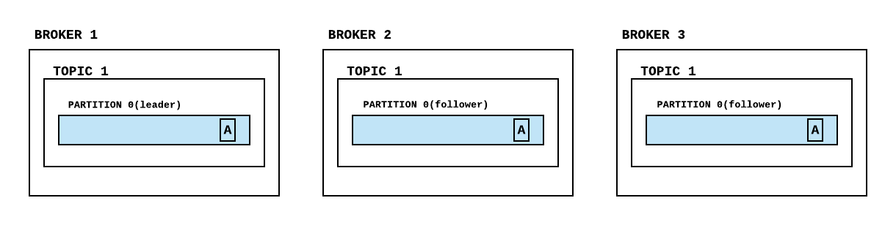

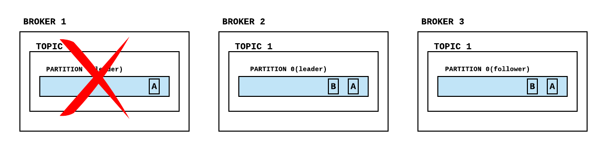

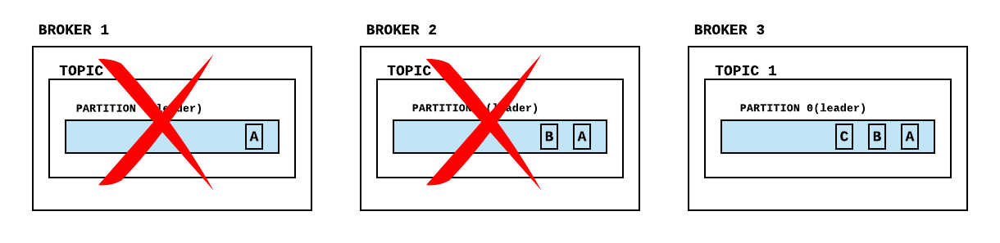

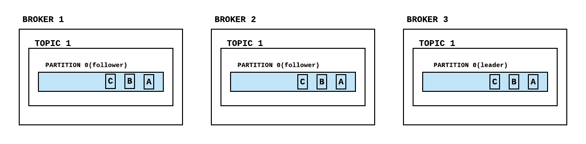

오류가 난 브로커들이 정상화 되었을때는 리더 브로커에서 데이터를 복제해온다. 그러나 운이 없게 3개의 브로커다 모두 고장나면 2가지 방법이 있다. 이 부분에 대해서는 시간이 중요한지 아니면 데이터가 중요한지 사용자가 판단해야 한다.

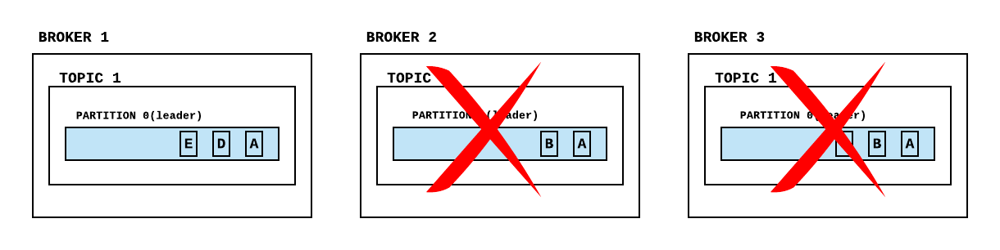

만약 시간을 중요시 하면 위 그림처럼 데이터의 일부가 손실될 가능성이 있다. 3개의 브로커가 고장난 후 브로커 1이 복구가 되면 이곳에 데이터들이 쌓이게 될 것이다.

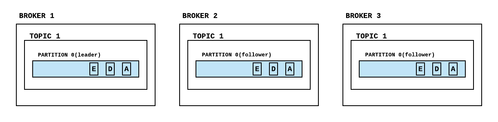

그리고 나머지 브로커들이 복구되면 브로커 1 에 있는 데이터들이 복제되어 기존에 있던 데이터들이 손실된다. 반대로 데이터를 중요시 하면 마지막 리더였던 브로커가 복구될 때까지 기다려야한다.

### **Producer**

프로듀서는 데이터를 전송하는 역할은 한다. 프로듀서는 토픽으로 데이터들을 하나씩 보낼 수 있고 아니면 배치로 묶어서 보낼 수 있다. 그 외에도 프로튜서는 Acks를 설정할 수 있다. Acks는 데이터가 토픽으로 잘 전송되었는지 프로듀서에게 확인해주는 역할을 한다. Acks는 3가지 종류가 있다.


```
acks = 0

    - 전송 속도: 매우 빠름
    - 데이터를 전송만 한 후 리더가 받았는지 확인하지 않음 (데이터 손실 확인 불가)

acks = 1 (default)

    - 전송 속도: 상대적으로 빠름
    - 리더가 받았는지 확인하지만 브로커 오류로 인한 데이터 손실 가능

acks = all

    - 전송 속도: 느림
    - 리더와 팔로워들이 받았는지 확인하므로 안전하게 데이터 전송함
```

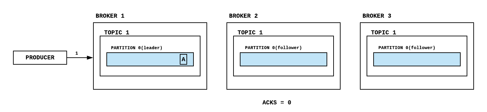


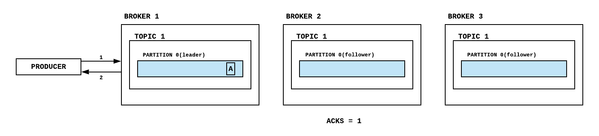


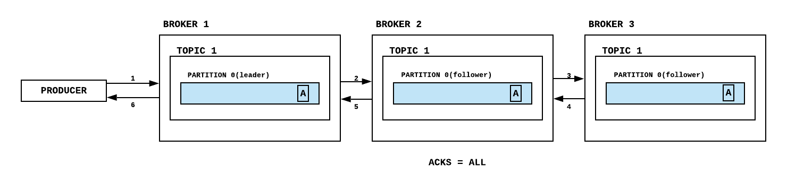

UDP 와 TCP와 비슷한 개념 아닐까 라는 생각이 든다. 그런데 왜 acks = 1 에서 데이터 손실이 있을 수 있을까? Acks = 1 은 acks = all 과 달리 팔로워들이 데이터들을 받았는지 확인하지 않는다. 그래서 프로듀서가 리더에 데이터가 전송이 되었다는걸 확인했어도 리더가 팔로워들에게 데이터를 복제했는지 여부는 확인하지 않기 때문에 리더에 오류가 생기면 데이터 손실이 있을 수 있다.


### **Consumer**


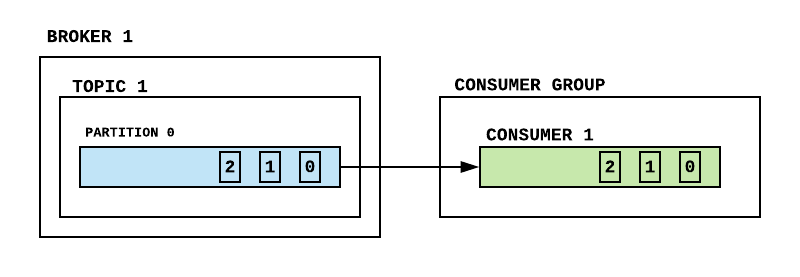

컨슈머는 파티션에서 데이터를 불러오는 역할을 한다. 여기서 데이터들이 파티션에 추가될 때 주어진 offset 값을 통해 순서대로 불러온다.

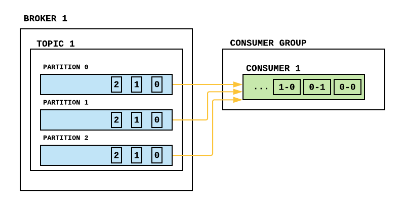

그런데 파티션 수가 2개 이상이면 어떻게 될까? 컨슈머는 각 파티션에서 offset을 순서대로 데이터를 불러오지만 파티션 순서는 상관하지 않는다. 즉 2번 파티션에서 offset 순서대로 가져오고 1번 파티션에서 offset 순서대로 가져온다. 만약 컨슈머가 데이터를 순서대로 받고 싶으면 데이터에 시간 등 순서를 나타낼 수 있는 플드를 추가해 데이터를 불러온 후 정렬하면 된다.

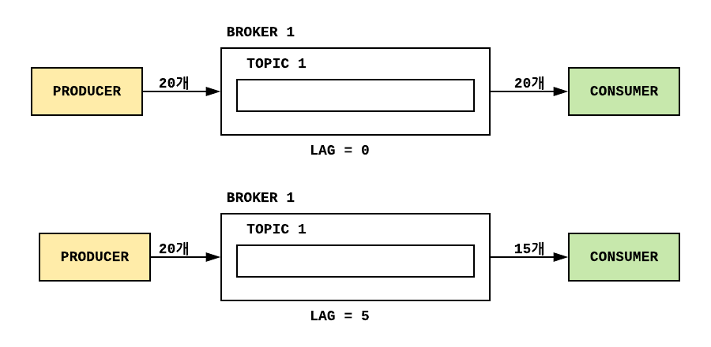

그 외에도 컨슈머는 프로듀서가 토픽에 데이터를 전송하는 속도를 따라갈 수 없을 수도 있다. 이것을 **lag** 이라고 하고 컨슈머가 데이터를 불러오지 못하는 수를 가르킨다. 

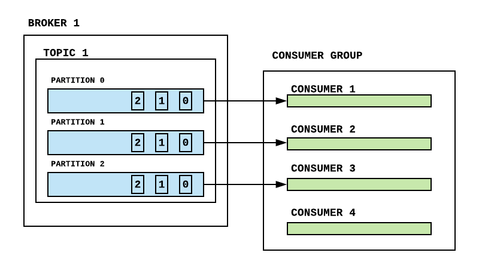

그래서 프로듀서가 보낸 데이터를 컨슈머가 밀리지 않고 불러오려면 컨슈머 수를 늘려 불러오는 비율을 맞출 수 있다. 그리고 이러한 컨슈머들의 집합을 **consumer group** 이라고 한다. 1개의 파티션은 1개의 컨슈머와 매핑이 된다. 효율적으로 데이터 처리를 원한다면 컨슈머 수를 파티션 수와 같게하면 된다. 아니면 적어도 파티션 수 보다는 같거나 적게 있어야 한다. 만약 컨슈머 수가 파티션 수보다 많으면 파티션과 매핑되지 않은 컨슈머는 아무 역할은 안하게 된다.

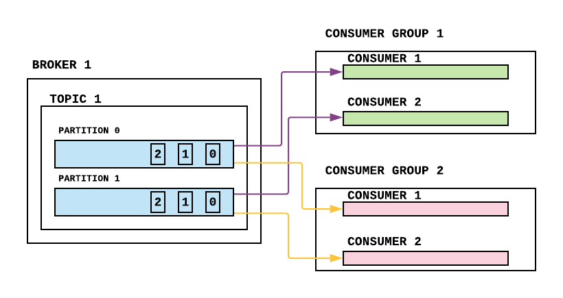

그런데 1개 이상의 컨슈머 그룹이 있으면 offset을 어떻게 관리할까? 각 파티션이 컨슈머 그룹별로 offset을 관리시켜 준다. 예를 들면 2개의 컨슈머 그룹이 있으면 각 파티션은 2개의 offset을 가지고 있어 컨슈머 그룹간의 독립성을 유지해준다.

[Apache Kafka (Part II)](kafka_part2)