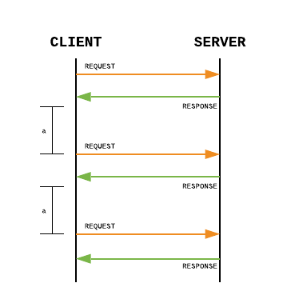
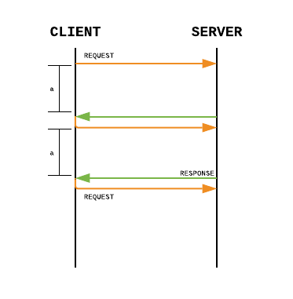
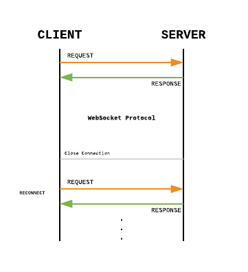

# Polling & WebSocket

HyperText Text Protocol (HTTP) 는 클라이언트와 서버가 인터넷으로 데이터를 주고 받을 수 있게 해주는 프로토콜이다. 우리가 자주 사용하는 인터넷에 A 페이지로 가달라고 요청 (request) 을 보내면 HTTP 규약에 맞게 데이터가 서버로 전해지고 서버는 이 규정에 맞게 응답 (response) 을 해준다. HTTP 는 **비연결성 (connectionless), 무상태 (stateless)** 프로토콜이다. 한번의 요청과 응답이 이루어지면 연결이 끊기고 데이터는 사라진다. 이 부분을 완화하기 위해 쿠키 (Cookie) 또는 세션 (Session) 을 사용한다. 

HTTP 는 클라인어트가 요청을 보내면 서버가 응답을 해주는 구조여서 서버가 클라이언트에게 직접 요청을 보낼 수 없다. 예를 들면, A 와 B 사이에 채팅을 한다고 하자. A 가 B 에게 메시지를 전송했다고 하면 A 는 서버로 메시지를 보내지지만 서버에서 B 로 메시지가 전달되지 않는다. B 는 채팅방에 접속하거나 새로고침을 눌러 새로운 요청을 만들어서 추가된 데이터를 응답 받아야 한다. 그런데 계속 새로고침을 통해 페이지를 요청하는건 귀찮은 일이다. 그럼 어떻게 지속적으로 메시지를 받을 수 있을까?

## Polling

Polling 은 주기를 정해서 서버에 요청을 보내고 응답을 받는 형식이다. 그러나 새로운 데이터가 없으면 빈 응답이 온다. HTTP 는 요청을 보낼 때 헤더에 정보를 담는다. 그러나 빈 응답을 위해 이러한 요청을 주기적으로 보낸다면 불필요한 네트워크 요청을 통해 자원을 낭비하는 행동이다. 그리고 주기적으로 요청을 보내므로 채팅 예시를 들면 메시지를 받는 부분에 조금의 지연이 있을 수 있다.

## Long Polling

Long Polling 은 Polling 과 비슷하지만 주기적으로 요청을 보내는 방법이 아니라 특정 시간동안 기다리는 방법이다. 만약 a 시간동안 서버에 새로운 데이터가 들어오면 바로 응답을 보낸다. 그리고 클라이언트는 바로 서버에 요청을 보내고 a 시간 동안 기다린다. 그러나 특정 시간동안 아무 변화가 없으면 빈 응답을 반환한고 다시 요청을 보낸다.

## WebSocket

WebSocket 은 HTTP 와 반대로 양방향 통신을 통해 데이터를 전송할 수 있는 기술이다. 즉, **상태 (Stateful)** 프로토콜이다. 웹 소켓은 클라이언트가 서버로 Upgrade 요청 (WebSocket handshake) 을 보내고 서버가  `HTTP 101 Switching Protocol` 을 응답하면 웹 소켓 연결이 설립된다. 그리고 웹 소켓으로 연결된 클라이언트 중 한군데에서 나가면, 예를 들면 브라우저 창을 닫으면, 연결이 끊긴다.

Polling 이나 Long Polling 방법은 주기적으로 요청을 보내고 응답을 받는 형식으로 자원을 낭비하는 부분이 있다. 반대로 Web Socket 은 한번의 요청과 응답으로 연결을 유지할 수 있다. 그러나 옛날 버전의 브라우저는 웹 소켓 지원을 안한다.

### HTTP Keep-Alive 와 WebSocket 차이

HTTP 는 응답을 받으면 연결이 끊긴다. 그래서 헤더에 Keep-Alive 를 통해 연결 시간과 요청 개수를 설정해 이미 연결되어 있는 상태에서 작업을 반복하는데 사용할 수 있다. 그리고 설정한 시간이 지나면 연결이 끊긴다. Keep-Alive 의 주 목적은 HTTP 요청을 통해 반복되는 TCP 연결을 줄이기 위함이다. 그러나 HTTP 요청/응답 구조를 가지고 있어 서버에서는 클라이언트로 요청을 못 보낸다. 웹 소켓과 목적이 다르다.