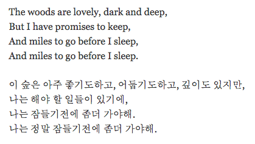

```{r setup, include=FALSE}
knitr::opts_chunk$set(echo = TRUE)
```

OCR이란 문자 인식 기술이다. 대부분 `tesseract`이라고 들어봤을 것이다. 개인적인 의견이겠지만 `tesseract`은 한국어 인식이 Naver Clova OCR에 비해 성능이 떨어지는거 같다. 비록 어떤 이미지를 입력하냐에 따라 결과가 달라지겠지만 한국어 인식에는 Clova OCR이 더 나은거 같다. 그러나 Clova OCR은 `tesseract`에 비해 OCR 옵션들이 없어 현재로는 단어만 뽑을 수 있지 다양한 옵션으로 뽑을 수는 없다. 그러나 개선된 OCR 엔진이 올해 4월에 출시 될 예정이라 하니... 기다릴 수 밖에...

이 문서는 R에서 `tesseract` 이랑 Naver Clova OCR 사용법에 대해서 알아보겠다. 파이썬에서 사용법은 [여기]()를 확인해보면 된다.

<br>  

### `tesseract` 설치

```{r install_pkg, message=FALSE, eval=FALSE}

install.packages("tesseract")

```


```{r load_lib, message=FALSE}

library(tesseract)

```


`tesseract`에 대한 정보는 `tesseract_info()`를 통해 보면 된다. `$available`은 현재 사용 가능한 언어들이다. 만약 다른 언어들을 설치하려면 `tesseract_download()`를 사용하면 된다. 그리고 `tesseract`에 옵션을 추가하려면 `tesseract_params()`를 사용하면 된다.


```{r config_pkg, message=FALSE, eval=FALSE}

# tesseract 정보
tesseract_info()

# 언어 설치
tesseract_download("kor")

# 옵션 리스트
tesseract_params()
tesseract_params(filter="")

```

<br>  

### `tesseract` 예시  

예제로 아래의 사진을 `tesseract`을 사용해서 문자들을 추출해보자. `ocr()`은 텍스트만 추출하고 `ocr_data()`를 사용하면 텍스트 및 적확성과 단어 위치 정보를 데이터프레임으로 반환한다. 밑에 사진에는 영어와 한국어가 있어서 `language` 인자에 `eng+kor`를 해주면 된다.

______________________________



______________________________

```{r tesseract_example1, message=FALSE, results=FALSE}

## tesseract 엔진 설정
# tesseract(language = NULL, datapath = NULL, configs = NULL, options = NULL, cache = TRUE)

img <- "pics/example1.png"

ocr(img, engine = tesseract(language = "eng+kor"))

ocr_data(img, engine = tesseract(language = "eng+kor"))


```

만약 추가적으로 옵션을 사용하고 싶다면 `options` 인자에 추가하면 된다. `tesseract_params()`에서 적절한 옵션을 찾아서 사용하면 된다.  

```{r tesseract_example2, results=FALSE}

ocr_data(img, engine = tesseract(language = "eng+kor", 
                                 options = list(tessedit_pageseg_mode = 4,
                                                preserve_interword_spaces = 1)))

```

<br>  

### Naver Clova OCR  

이제 네이버 클로버 OCR 엔진을 사용해서 텍스트를 추출해 보겠다. 먼저 [네이버 클라우드](https://www.ncloud.com/)에 가입해서 `General` 서비스 타입으로 OCR 도메인을 생성한다. 그리고 `Secret Key`를 생성한 후 아래와 같이 API 호출을 하면 된다.

```{r}


```

