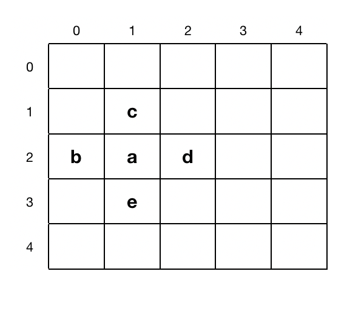
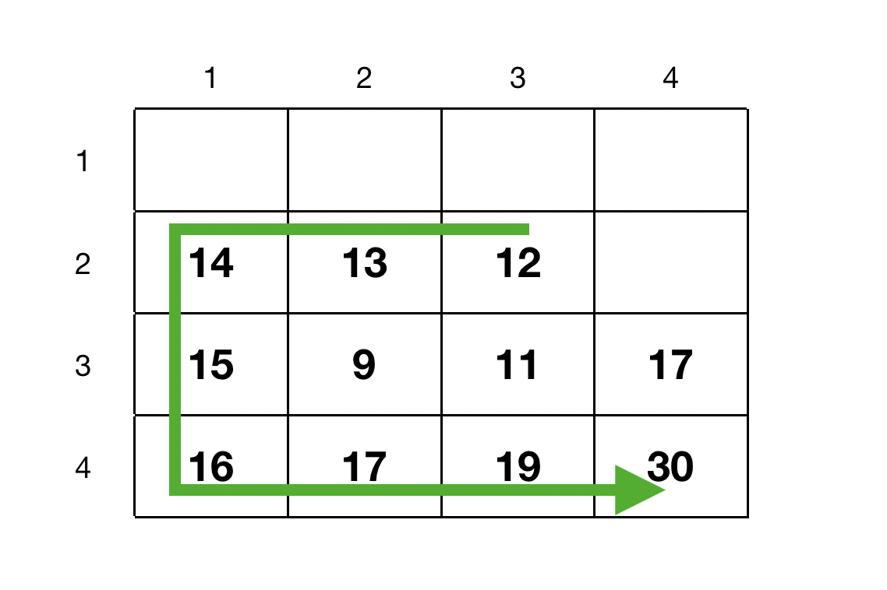
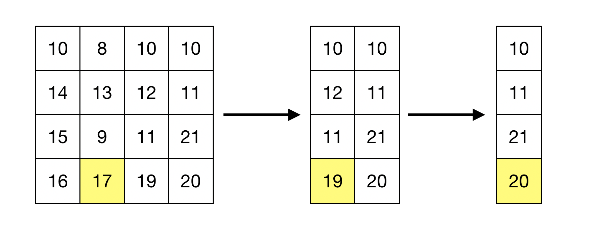

이 문서는 다양한 알고리즘에 대해 정리한 문서이다. 복습용으로 만든 문서이므로 내용이 틀릴 가능성도 있다...

MIT OpenCourseWare에 있는 [MIT 6.006 Introduction to Algorithms](https://ocw.mit.edu/courses/electrical-engineering-and-computer-science/6-006-introduction-to-algorithms-fall-2011/) 강의를 수강한 후 작성한 복습용 문서이다.

### 알고리즘 (Algorithm)

컴퓨팅에서 알고리즘은 문제를 효율적으로 처리할 수 있는 명령어들이다. 컴퓨터는 초당 많은 작업들을 처리할 수 있지만 한계가 있다. 그러므로 입력값이 커질수록 어떻게 하면 작업을 효율적으로 처리할 수 있는지 중요해진다.

### Peak Finding (극댓값 찾기)

Peak finding은 주어진 배열에서, 만약 존재한다면, 처음으로 나오는 극댓값을 찾는 방법이다. 즉, 최소의 시간으로 가장 높은 값을 찾는 과정이다. [a, b, c, d, e, f, g, h, i] 정수값 배열이 있으면 2번째 값인 b가 극댓값이 되려면 $b \ge a$ 그리고 $b \le c$ 조건을 만족해야된다. i 같은 경우 한부분 ($i \ge h$)를 만족하면 된다. 

#### **1차원 (1D)** 

배열 [1, 2, ..., $\frac{n}{2}$, ..., $n-1$, $n$] (인덱스 값을 배열의 값으로 둠) 있다고 하자. 만약 $\frac{n}{2}$ 위치가 극대값이라 하면 컴퓨터는 1번부터 시작해 $\frac{n}{2}$번까지 비교해가 값을 찾는다. 그러면 극대값이 마지막 $n$ 번째에 있으면 모든 배열을 읽어야 한다. 그러므로 최악의 경우 시간 복잡도는 $\theta(n)$이다. 만약 배열이 크기가 $10^{99}$라고 치면 시간이 엄청 오래 걸릴 것이다. 그럼 더 좋은 방법이 없을까?

Divide-and-Conquer (분할 정복) 알고리즘을 사용해서 풀어보자. 분할 정복 알고리즘은 문제를 두개로 쪼개서 해결하고 나중에 합치는 과정이다. A = [1, 2, ..., $\frac{n}{2} - 1$, $\frac{n}{2}$, $\frac{n}{2} + 1$, ..., $n-1$, $n$] 배열이 있으면중간값 $frac{n}{2}$를 선택한다. A[$\frac{n}{2}$] $\le$ A[$\frac{n}{2} - 1$]이면 왼쪽 부분인 [1, 2, ... $\frac{n}{2} - 1$]에서 극댓값을 찾으면 되고 A[$\frac{n}{2}$] $\le$ A[$\frac{n}{2} + 1$]이면 오른쪽 부분인 [$\frac{n}{2} + 1$, ... , $n$] 부분에서 극댓값을 찾으면 된다. 여기서 또 중간값을 찾아 과정을 반복하면 된다. 두 조건을 만족하지 않으면 A[$\frac{n}{2}$] 값이 극댓값이 된다.

위에 과정을 $T(n) = T(\frac{n}{2}) + \theta(1)$ 으로 표현할 수 있다. 여기서 $\theta(1)$은 $T(\frac{n}{2})$ 에서 왼쪽과 오른쪽 값을 비교할떄 시간 복잡도는 일정하기 때문이다. 반을 나누고 또 나누고 하면 시간 복잡도는 $(\theta(1) + \theta(1) + ... + \theta(1))$ x $log_{2}{n}$ 이므로 $\theta(log_{2}{n})$이다. $n$ 값이 크면 다음 조건을 만족한다 $\theta(log_{2}{n}) > \theta(n)$.

 

#### **2차원 (2D)** 

위 그림처럼 2차원 배열(행렬)에서 a가 극댓값이 되러면 $a \ge b$, $a \ge c$, $a \ge d$, $a \ge e$ 조건을 모두 만족해야 한다. 

위에 그림에서 극댓값을 찾으려면 Greedy Ascent algorithm을 사용할 수 있다. 먼저 시작점을 고른다. 그리고 위에 조건을 만족하지 않으면 비교하는 값들 중 가장 큰 값이 있는 방향으로 간다. 그리고 극댓값을 구할때까지 이 과정을 반복한다.

위에 그림에서는 12를 시작점을 두고 시작했다. 왼쪽 13은 12보다 크므로 13으로 이동한 후 그 과정을 계속 반복한다. 그러면 마지막으로 30인 극댓값을 구할 수 있다. 그러나 이 방식은 시작점을 어디에 두는지 처리 시간이 달라진다. 그러나 최악인 경우는 모든 행과 열을 거쳐야한다. 그러면 위 과정의 시간 복잡도는 $\theta(mn)$이 되고 $m=n$이면 $\theta(n^{2})$이 되므로 더 좋은 알고리즘을 알아봐야 할 것이다.

여기서도 분할 정복 알고리즘을 적용해볼 수 있다. 위에 $n$x$m$ 행렬이 있다고 하면 $j = \frac{m}{2}$ 열을 고른다. 그리고 $j$ 열에서 최댓값을 찾는다. 최댓값이 $(i,j)$에 위치해 있다고 하면 $(i,j - 1) > (i,j)$ 이면 왼쪽 부분을 사용하고 $(i,j + 1) > (i,j)$이면 오른쪽 부분을 사용한다. 만약 둘다 조건을 만족하지 않으면 $(i,j)$가 극댓값이 된다. 

위에 그림에  $A$ 행열이 있다고 하자. 그럼 중간열인 2열을 보면 최댓값은 $A[4,2] = 17$이다. 그러면 $A[4,1] = 16$과 $A[4,3] = 19$를 비교 한다. $A[4,3]$이 크므로 3번열 이후의 부분을 보고 이 과정을 반복하면 마지막 극댓값인 20을 얻을 수 있다. 2차원에서 분할 정복 알고리즘은 $T(n, m) = T(n,\frac{m}{2}) + \theta(n)$ 표현할 수 있다. $j$열의 모든 행을 거쳐 최댓값을 찾아야 하므로 $\theta(n)$을 더해주는 것이다. 위에 과정을 계속 반복하면 $log_{2}{m}$번 열들을 처리해야 하고 각 열마다 $\theta(n)$의 시간 복잡도가 있으니 위 알고리즘의 시간 복잡도는 $\theta(nlog_{2}{m})$이다.
