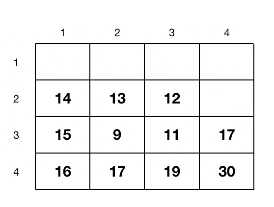

이 문서는 다양한 알고리즘에 대해 정리한 문서이다. 복습용으로 만든 문서이므로 내용이 틀릴 가능성도 있다...

MIT OpenCourseWare에 있는 [MIT 6.006 Introduction to Algorithms](https://ocw.mit.edu/courses/electrical-engineering-and-computer-science/6-006-introduction-to-algorithms-fall-2011/) 강의를 수강한 후 작성한 복습용 문서이다.

### 알고리즘 (Algorithm)

컴퓨팅에서 알고리즘은 문제를 효율적으로 처리할 수 있는 명령어들이다. 컴퓨터는 초당 많은 작업들을 처리할 수 있지만 한계가 있다. 그러므로 입력값이 커질수록 어떻게 하면 작업을 효율적으로 처리할 수 있는지 중요해진다.

### Peak Finding (극댓값 찾기)

Peak finding은 주어진 배열에서, 만약 존재한다면, 처음으로 나오는 극댓값을 찾는 방법이다. 즉, 최소의 시간으로 가장 높은 값을 찾는 과정이다. [a, b, c, d, e, f, g, h, i] 정수값 배열이 있으면 2번째 값인 b가 극댓값이 되려면 $b \ge a$ 그리고 $b \le c$ 조건을 만족해야된다. i 같은 경우 한부분 ($i \ge h$)를 만족하면 된다. 

 

**1차원 (1D)** 

배열 [1, 2, ..., $\frac{n}{2}$, ..., $n-1$, $n$] (인덱스 값을 배열의 값으로 둠) 있다고 하자. 만약 $\frac{n}{2}$ 위치가 극대값이라 하면 컴퓨터는 1번부터 시작해 $\frac{n}{2}$번까지 비교해가 값을 찾는다. 그러면 극대값이 마지막 $n$ 번째에 있으면 모든 배열을 읽어야 한다. 그러므로 최악의 경우 시간 복잡도는 $\theta(n)$이다. 만약 배열이 크기가 $10^{99}$라고 치면 시간이 엄청 오래 걸릴 것이다. 그럼 더 좋은 방법이 없을까?

Divide-and-Conquer (분할 정복) 알고리즘을 사용해서 풀어보자. 분할 정복 알고리즘은 문제를 두개로 쪼개서 해결하고 나중에 합치는 과정이다. A = [1, 2, ..., $\frac{n}{2} - 1$, $\frac{n}{2}$, $\frac{n}{2} + 1$, ..., $n-1$, $n$] 배열이 있으면중간값 $frac{n}{2}$를 선택한다. A[$\frac{n}{2}$] $\le$ A[$\frac{n}{2} - 1$]이면 왼쪽 부분인 [1, 2, ... $\frac{n}{2} - 1$]에서 극댓값을 찾으면 되고 A[$\frac{n}{2}$] $\le$ A[$\frac{n}{2} + 1$]이면 오른쪽 부분인 [$\frac{n}{2} + 1$, ... , $n$] 부분에서 극댓값을 찾으면 된다. 여기서 또 중간값을 찾아 과정을 반복하면 된다. 두 조건을 만족하지 않으면 A[$\frac{n}{2}$] 값이 극댓값이 된다.

위에 과정을 $T(n) = T(\frac{n}{2}) + \theta(1)$ 으로 표현할 수 있다. 여기서 $\theta(1)$은 $T(\frac{n}{2})$ 에서 왼쪽과 오른쪽 값을 비교할떄 시간 복잡도는 일정하기 때문이다. 반을 나누고 또 나누고 하면 시간 복잡도는 $(\theta(1) + \theta(1) + ... + \theta(1))$ x $log_{2}{n}$ 이므로 $\theta(log_{2}{n})$이다. $n$ 값이 크면 다음 조건을 만족한다 $\theta(log_{2}{n}) > \theta(n)$.

 

**2차원 (2D)** 

위 그림처럼 2차원 배열(행렬)에서 a가 극댓값이 되러면 $a \ge b$, $a \ge c$, $a \ge d$, $a \ge e$ 조건을 모두 만족해야 한다. 

위에 그림에서 극댓값을 찾으려면 Greedy Ascent algorithm을 사용할 수 있다. 먼저 시작점을 고른다. 그리고 위에 조건을 만족하지 않으면 비교하는 값들 중 가장 큰 값이 있는 방향으로 간다. 그리고 극댓값을 구할때까지 이 과정을 반복한다.

위에 그림에서는 12를 시작점을 두고 시작했다. 왼쪽 13은 12보다 크므로 13으로 이동한 후 그 과정을 계속 반복한다. 그러면 마지막으로 30인 극댓값을 구할 수 있다. 그러나 이 방식은 시작점을 어디에 두는지 처리 시간이 달라진다. 그러나 최악인 경우는 모든 행과 열을 거쳐야한다. 그러면 위 과정의 시간 복잡도는 $\theta(mn)$이 되고 $m=n$이면 $\theta(n^{2})$이 되므로 더 좋은 알고리즘을 알아봐야 할 것이다.

여기서도 분할 정복 알고리즘을 적용해볼 수 있다. 위에 $n$x$m$ 행렬이 있다고 하면 $j = \frac{m}{2}$ 열을 고른다. 그리고 $j$ 열에서 최댓값을 찾는다. 최댓값이 $(i,j)$에 위치해 있다고 하면 $(i,j - 1) > (i,j)$ 이면 왼쪽 부분을 사용하고 $(i,j + 1) > (i,j)$이면 오른쪽 부분을 사용한다. 만약 둘다 조건을 만족하지 않으면 $(i,j)$가 극댓값이 된다. 

위에 그림에  $A$ 행열이 있다고 하자. 그럼 중간열인 2열을 보면 최댓값은 $A[4,2] = 17$이다. 그러면 $A[4,1] = 16$과 $A[4,3] = 19$를 비교 한다. $A[4,3]$이 크므로 3번열 이후의 부분을 보고 이 과정을 반복하면 마지막 극댓값인 20을 얻을 수 있다. 2차원에서 분할 정복 알고리즘은 $T(n, m) = T(n,\frac{m}{2}) + \theta(n)$ 표현할 수 있다. $j$열의 모든 행을 거쳐 최댓값을 찾아야 하므로 $\theta(n)$을 더해주는 것이다. 위에 과정을 계속 반복하면 $log_{2}{m}$번 열들을 처리해야 하고 각 열마다 $\theta(n)$의 시간 복잡도가 있으니 위 알고리즘의 시간 복잡도는 $\theta(nlog_{2}{m})$이다.

### Sorting Algorithms (정렬 알고리즘)

문제를 풀려고 할때 순서가 중요할 수도 있다. 정렬에 대한 알고리즘은 많고 문제에 따라 그리고 어떻게 해결할지에 따라 사용되는 알고리즘이 달라진다. 시간을 더 중요시 생각할 수도 있고 아니면 문제를 해결하기 위해 차지하는 메모리 공간을 더 생각할 수 있다. 정확이 이 알고리즘이 좋고 저 알고리즘이 안좋다라고 판정할 수 없다.

#### Insertion Sort (삽입 정렬)

삽입 정렬 방법은 배열의 앞부분 부터 시작해서 차례대로 그 값보다 작은 값들과 비교해서 정렬하는 방식이다.

위에 그림을 처럼 $A = [5, 2, 6, 1, 3]$ 배열이 있다고 하자. 삽입  정렬은 $A[i]$의 값을 $A[:i-1]$ 값들과 하나하나씩 비교해 정렬하는 방식이다. 처음에 2에 키값이 있으면 1번 값과 비교한다. 그리고 값이 작으면 바꾼다. 그 다음 키값 6은 5보다 크므로 그대로 두고 다음 단계로 간다. 다음 단계부터 조금 일이 많아진다. 키값이 $A[3] = 1$이고 $A[3] < A[2] = 6$ 이므로 위치를 바꾼다. 여기서 끝난게 아니라 똑같은 과정으로 $A[0]$까지 가야한다. 그럼 이제 $A[2] = 1$이고 $A[1] = 5$와 비교한다. $A[2] < A[1]$이므로 위치를 바꿔줘서 $A[0]$까지 한다. 그리고 이 과정이 끝나면 다음 키값인 $A[4] = 3$을 전에 나온 과정들을 반복한다. 그러면 마지막으로 $A = [1 2, 3, 5, 6]$ 오름차순 배열로 정렬이 된다.

모든 배열의 값들을 확인해야 하므로 시간 복잡도는 $\theta(n)$이다. 그리고 각 키값마다 $\theta(n)$만큼 비교하고 바꾸어야 하니 위에 방법의 삽잉 정렬의 시간 복잡도는 $\theta(n^{2})$이다. 이것보다 좀 더 효율적으로 할 수 있는 방법은 전에는 두개의 짝을 비교했지만 이진 탐색 (binary search) 방법이다. 이것을 이진 삽입 정렬 (binary insertion sort)라기도 한다.

전에는 키값을 전 값들과 하나하나 비교했지만, 이진 탐색을 사용하면 $A[:i-1]$의 중간값 $m$을 찾아 키값을 비교한다. 만약 키값이 중간값보다 크면 $A[m:i-1]$에서 이 과정을 반복하면 되고, 만약 중간값보다 작으면 $A[:m]$에서 위 과정을 반복하면 된다. 이진 탐색은 $\theta(log_{2}{n})$ 시간이 걸리고 $n$개의 값들이 있으니 값을 비교하는 시간 복잡도는 $\theta(nlog_{2}{n})$이다. 그러나 키값의 비교해 삽입할 위치를 찾는건 삽입 정렬 방식보다는 효율적일 수 있으나 이진 탐색을 사용해 삽입하는 시간 복잡도는 $\theta(n^{2})$이다. 왜냐하면 키값을 삽입 할 위치가 중간이면 그에 해당하는 오른쪽 부분을 모두 옮겨야하기 때문이다.

#### Merge Sort (합병 정렬)

합병 정렬도 분할 정복의 개념이다. $A$ 배열이 있으면 이것을 중간값을 기준으로 두개로 나눈다 ($L$ 배열과 $R$ 배열). 그리고 각 배열을 정렬하고 ($L`$ 배열과 $R`$ 배열) 합쳐 정렬이 된 하나의 배열로 만드는 방법이다. 

$A = [20, 2, 7, 13, 1, 11, 12, 9]$ 라는 배열을 정렬하려면 먼저 2개의 배열로 나누어서 각 배열을 정렬한다. 그리고 이 두 배열을 합병 할 때 two figer algorithm을 사용한다.  먼저 $L`$ 배열과 $R`$ 배열의 낮은 값들부터 비교를 해서 올라가는 방식이다. 위 그림을 보면 $L`[0] = 2$와 $R`[0] = 1$을 비교했을때 $R`[0]$ 값이 작으므로 빼서 배열에 놓는다. 그리고 다음 값으로 올라가  $L`[0] = 2$와 $R`[1] = 9$를 비교한다. 여기서는 $L`[0]$ 작으므로 이 값을 빼서 정렬된 배열에 놓는다. 이 과정을 반복하면 마지막으로 정렬된 $A = [1, 2, 7, 8, 11, 12, 13, 20]$ 배열이 만들어 진다.

합병 정렬의 시간 복잡도는 $\theta(nlog_{2}{n})$이다. 그 이유는 [페이지  23](https://ocw.mit.edu/courses/electrical-engineering-and-computer-science/6-006-introduction-to-algorithms-fall-2011/lecture-videos/MIT6_006F11_lec03.pdf) 강의 노트를 통해 확인하면 된다. 삽입 정렬보다는 효율적이나 공간 측면에서는 합병 정렬보다 삽입 정렬이 효율적일 수 있다. 합병 정렬은 기존 배열을 나누에 새로 정렬된 배열로 만드는 것이므로 메모리 공간은 삽입 정렬(옆값을 비교해 바꾸므로 일정하다) 에 비해 많이 차지한다.

#### Heap Sort (힙 정렬)

힙 정렬을 힙 자료구조에서 보여 주었듯이 max heap을 만든 후 정렬하는 과정이다.

위에 그림은 max heap이며 $A = [16, 14, 10, 8, 7, 9, 3, 2, 4, 1]$이라고 하면 힙 정렬은 1번째 $A[0]$와 배열의 마지막 값 $A[n]$과 바꾼다. 그러면 $A[0]$ -> $A[n]$ 이고 $A[n]$ -> $A[0]$이 되면 $A[n]$을 따로 빼서 새로운 배열에 놓는다. 이 과정을 모든 $A$ 배열 값들이 없어질 때까지 한다.

위에 그림처럼 1번째 값과 마지막인 10번째 값을 바꾼 후 이 값을 빼서 $A` = [16]$ 배열에 넣는다.

이제 트리를 max heap을 만들어야 하므로 루트 노드값인 1을 자식 노드와 비교한 후 가장 큰 값이랑 바꾼다. 이 과정을 전체 트리가 max heap가 될떄가지 한다. 그러면 위에 그림의 마지막 트리처럼 나올 것이다. 

위에 그림은 max heap 이므로 첫번깨 값과 마지막 값을 바꿔서 $A`$ 값에 넣는다. 그러면 $A` = [16, 14]$가 될 것이고 이제 루트 노드값이 1이므로 다시 max heap으로 만들어야 한다. 위에 과정을 $A`$가 모두 채워질때까지 반복한다.

#### Counting Sort (계수 정렬)

이제 선형시간으로 정렬하는 계수 정렬에 대해 알아보겠다. 만약 $k$ 값이 크지 않다고 가정하면 계수 정렬의 시간 복잡도는 $O(n)$에 가까워 진다고 볼 수도 있다. 계수 정렬 시간 복잡도는 $O(n + k)$이다. 이진 탐색은 값을 비교하면서 찾고 정렬했으나 계수 정렬은 첫번째 값부터 끝까지 데이터를 읽으면서 정렬하는 방법이다.

먼저 $A = [4, 1, 1, 0, 3, 1, 3]$ 배열에 있는 자료를 첫 인덱스부터 마지막 인덱스까지 읽으면서 새로운 리스트에 해당하는 값들을 센다. 

그리고 오른쪽 방향으로 각 인덱스 값을 누적으로 더한다.

그 다음 1인덱스를 오른쪽 방향으로 이동한 후 인덱스 아래 값들을 인덱스의 시작 위치이다. 예를 들면 위에 그림에서 인덱스 1의 값은 1이고 인덱스 2의 값은 4이다. 즉 새로운 리스트의 인덱스 1부터 $4-1 = 3$는 1의 값을 가진다는 거다. 2번과 3번 인덱스인 경우 값이 똑같으므로 없는 값이다. 그러면 $A = [4, 1, 1, 0, 3, 1, 3]$ 배열은 $A = [0, 1, 1, 1, 3, 3, 4]$ 정렬된 배열이 나온다.

### Rabin-Karp Algorithm

Rabin-Karp 알고리즘은 해싱을 사용해 텍스트를 찾아내는 알고리즘이다. 예를 들어 bbcaaca라는 문자가 있고 여기에 acc 단어가 있는지 확인해보자. 단어를 사용하는 것 보다는 각 단어를 해시 함수를 사용하여 정수로 변환 시킨다. 그리고 이 값들을 사용하여 문자에 원하는 단어가 있는지 확인하는 방법이다.

위에 그림처럼 해시값을 두면 aac 해기값의 합은 5이다. 이것을 이제 찾고자하는 문자에서 비교하면서 찾는다.

bbcaaca에서 첫 3단어의 해시값을 찾아서 더한다. 이 값이 찾고자 하는 5랑 같으면 각 단어의 해시값을 비교한다. 

만약 값이 틀리면 롤링 해시 함수를 사용한다. 이것은 왼쪽 값을 빼고 다음 값의 해시값을 찾아 더하는 방법이다. 위에 그림을 보면 bbc에서 맨 왼쪽인 b의 해시값을 빼준다. 그리고 다음 값인 a의 해시값을 더해준다.

만약 비교하는 해시값의 합이 같으면 이제 각 단어의 해시값을 비교한다. 위에 그림에서는 cca와 찾고자 하는 aac 단어와 합한 해시값은 같으나 첫 단어의 해시값 $3 \neq 1$이므로 다음으로 넘어간다.

위에 과정을 반복하면서 찾으려는 단어들을 찾을 수 있다. 단어의 값들은 해시 테이블을 사용해서 찾는 시간 복잡도는 $O(1)$이다. 그러나 합한 해시값이 같을 수 있는 확률이 높으며 이것을 하나씩 찾으다보면 최악의 경우 $O(mn)$ 시간 복잡도를 가질 수 있다. 여기서 $m$은 문장의 길이고 $n$은 찾고자 하는 단어의 길이다. 이 문제를 해결하기 위해서 해시 테이블에 있는 자료의 길이를 베이스를 두어서 각 단어의 해시값에 곱하면 된다. 

쉽게 설명하기 위해 10개의 단어들이 해시 테이블에 있다고 하자. 그러면 베이스값을 10으로 두는 것이다. 즉 3단어를 찾으면 1번째 단어의 해시값을 $10^2$로 곱하고 다음 해시값을 $10^1$ 그리고 $10^0$으로 곱한다. 위에 ced의 해시값을 베이스값을 사용해서 곱하고 더하면 354가 나온다. 그리고 위에 과정처럼 똑같이 롤링 해시 함수를 사용하면 원하는 값을 평균적으로 $O(n + m + 1)$시간 복잡도로 구할 수 있다. 단 최악의 경우... $O(mn)$이 걸릴 가능겅이 있지만 전 과정보다는 확률이 낮다고 볼 수 있다. 단 다음으로 넘어갈때 베이스 값을 곱해야 하는 차이가 있다. 

이 과정은 좋을 수 있으나 값이 커지면 할당한 메모리 용량을 넘어갈 수 있다. 그러므로 곱한 값들을 모드 함수를 사용하면 값을 줄일 수 있으나 이러면 위에처럼 단어들은 틀리나 해시값이 같을 수 있는 확률이 더 높아진다. 

### Shortest Path (최단 경로)

최단 경로란 `u`와 `v` 정점들을 연결하는 간선들에 가중치의 합이 최소가 되는 경로이다.

#### Dijkstra (다익스트라)

Djikstra는 모든 정점들에서의 최단 경로를 찾는 알고리즘이다. 이 알고리즘에서 주의해야할 점은 음성 가중치가 있으면 안된다. 다익스트라 알고리즘은 시작 점정을 정하고 그 정점에서 간선들로 연결되어 있는 정점들의 거리를 구한다. 만약 $u$ 에서 $v$ 정점으로 가는 경로에 $d[v] > d[u] + w(u, v)$ 조건을 만족하면 $u$, $v$ 에 대해 relaxtion 한다고 말한다. 즉, 원래 정점의 값이 전 정점에서 가중치를 더한 값보다 크면 해당 정점의 값을 바꾼다라고 생각한면 된다.

시작 정점을 $A$라 하면 $d[A] = 0$의 값을 가지고 있으며 나머지 정점들은 무한의 값을 가진다. $A$ 정점에 시작하면 $B$와 $C$를 갈 수 있으며 $A$ 값에 가중치를 더하면 $d[B]=3$ 와 $d[C]=10$ 값을 가진다. 여기서 모든 정점들의 값들을 보면 $[A, B, C, D, E] = [0, 3, 10, \infty, \infty]$ 이다. 이미 $A$는 사용했으니 빼고 나머지 값들에서 최소값을 찾으면 $B$ 정점이다. 그럼 다음으로 최소 경로는 $B$ 정점에서 시작하고 $A$와의 간선을 relaxation 이라고 한다.

$B$ 정점에서 이제 $C$, $D$, $E$ 정점으로 가는 거리를 구해 업데이트 한다. 그리고 여기서 최소의 값을 가진 정점을 찾은 후 위 과정을 다시 반복한다.

이 과정을 더이상 relxation 할 간선/정점이 없을때까지 한다. $A$ 에서 최소 경로는 $A - B - D - C - E$가 된다. 

