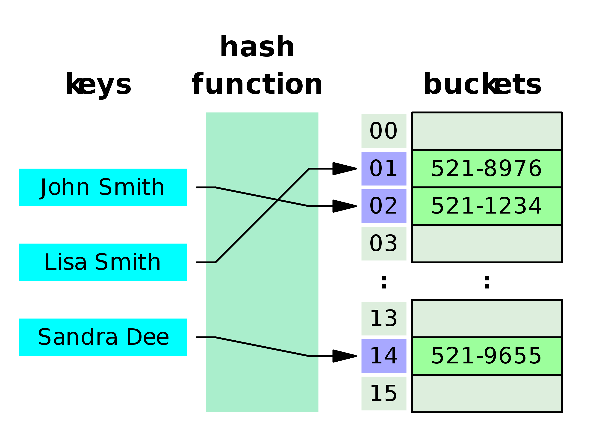
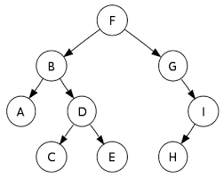
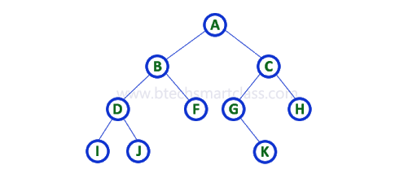
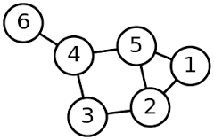
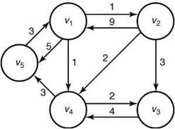
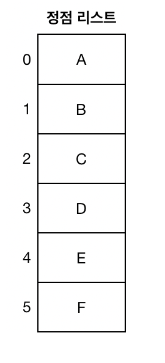
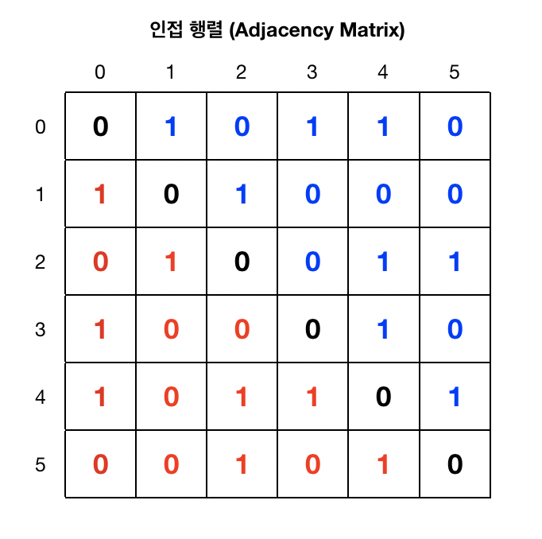
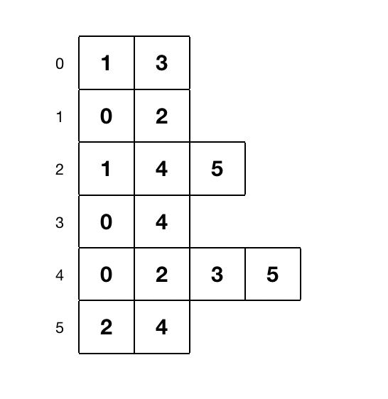

```{r setup, include=FALSE}
knitr::opts_chunk$set(echo = TRUE)
```

이곳은 자료구조와 알고리즘에 대해 직접 학습하고 자료 정리를 위한 문서이다.  

----------------  
### 메모리란? (Memory)  

자료구조를 배우기전에 메모리가 대충 무엇인지 어떤 역할을 하는지 알고있는게 중요하다. 노트북을 살때 메모리가 8GB, 16GB 이라고 들어본적이 있을것이다. 정말 간단히 요약 하자면 메모리는 마치 휴게소 역할을 하는 임시 저장소라고 생각하면 편할꺼 같다. 반대로 HDD 또는 SSD 저장 장치는 영구적이며 읽고/쓰기 속도는 메모리보다 느리다. 그래서 앱을 실행시킬 때 우리가 바로 읽고 사용할 수 있게 데이터들은 메모리에 저장이 된다. 단점은 컴퓨터를 끄면 메모리에 저장된 데이터들을 다 지워진다. 

왜 메모리에 대한 개념이 중요하나? 예를 들어 변수를 지정할때 아니면 결과를 반환할때 그 결과값은 메모리 안 어딘가에는 할당이 될 것이다. **이것을 어떻게 효율적으로 할당해서 불러오고 사용할 수 있는지를 배우는게 자료구조이다.**


### 알고리즘의 성능 분석  

1) 공간 복잡도(Space Complexity) : 알고리즘에 사용되는 메모리 공간의 총량
2) 시간 복잡도(Time Complexity) : 알고리즘에 사용되는 연산횟수의 총량


### 배열 (Array)  

배열은 한가지의 데이터 타입으로 묶여진 집합이다. 배열을 생성할 때 크기를 정한다. 예를 들면`int L[5];`는 크기가 5인 배열이다. 메모리에서 정수의 크기는 4 byte이다. 그러므로 `L` 배열은 20 byte 크기의 메모리가 할당이 된다. 배열에서는 주어진 크기 안에서는 데이터를 삽입하거나 제거할 수 있으나 배열의 사이즈는 못 바꾼다. 예를 들면 뒤에 데이터를 덧붙이지 못한다. 그리고 메모리에 임의로 할당 되어서 배열값을 할당한 후 다른 변수가 그 뒤에 할당될 수도 있다. 그러므로 배열의 크기를 조정하려면 다른 메모리 주소에 할당을 해야된다. 이때 이전에 있던 배열의 데이터를 그대로 불러온 후 그 뒤에 추가로 데이터들을 삽입하면 된다. 이때 주로 배열의 크기를 전 배열의 2배를 할당한다. 그러나 할당된 메모리를 모두 사용하지 않으면 자원을 버리는 것이므로 단점이 있으나 또 한편으로는 데이터를 읽는 속도는 일정한 장점이 있다.


### 연결 리스트 (Linked List)  

배열의 크기를 너무 크게 지정하면 메모리 자원을 낭비하게 된다. 연결 리스트는 이 문제를 해결해준다. 배열은 크기가 정해져 있어서 n 번째 값은 배열이 시작하는 메모리 주소에 찾고자 하는 값의 인덱스 값에 4를 곱하면 n번째 값을 찾을 수 있다. 그러나 연결 리스트는 각 값들이 메모리에 임의로 할당이 되어 있어 추가적인 정보가 필요하다. 그래서 연결 리스트는 각 값마다 8 bytes의 메모리가 할당된다. 4 bytes는 값에 해당되고 나머지 4 bytes는 다음 값이 있는 메모리 주소에 해당된다. 이것을 '노드 (Node)' 라고 한다. 비록 배열에 비해 메모리를 더 사용하지만 배열처럼 값을 추가하려면 다른 곳으로 모두 이동해야하는 번거러움이 없어서 값을 추가하고 제거하기 편하다. 하지만 배열은 특정 값을 찾을때 시간이 일정하지만 연결 리스트는 각 노드를 거쳐야 하기 때문에 배열보다는 속도가 느린 단점이 있다.


### 이중 연결 리스트 (Doubly Linked List)

단일 연결 리스트는 다음 노드의 주소가 저장되어 있다. 그래서 노드를 한 방향으로만 이동할 수 있다. 만약 반대로 이동하려면 반복문 또는 재귀 함수를 사용해야 하며 많은 변수를 사용해서 정보를 지정해야 한다. 그러나 이중 연결 리스트는 하나의 노드 안에 다음 노드 주소와 이전 주소가 포함되어 있어 데이터를 앞뒤로 쉽게 읽을 수 있다. 하지만 하나의 단점은 노드에 3가지의 정보가 들어 있어서 (데이터를 정수라고 가정하면) 총 12 bytes 의 메모리를 차지한다. 


### 해시 테이블 (Hash Table)

파이썬을 사용하다 보면 딕셔너리 자료형을 사용해봤을 것이다. 딕셔너리는 키(Key)를 통해 값(Value)을 불러온다. 즉, 특정 값을 찾기 위해 하나하나 찾는게 아니라 찾으려는 키값을 통해 원하는 데이터를 찾는다. 해시 테이블은 키와 값들을 배열로 저장하는 자료구조이다. 해시 테이블에는 3가지 단계가 있다.



먼저 원래 데이터인 키값은 해시 함수 (Hash Function)을 거친다. 해시 함수는 키값을 해시 (Hash) 값으로 바꾸어 준다. 여기서 해시값이란 인덱스 값이다. 여기서 나온 해시 값을 사용해서 저장소 (Bucket)에 해당하는 인덱스 위치에 값을 넣거나 찾는다. 위에 그림을 통해 John Smith의 전화번호를 저장해보자. "John Smith" 키값을 해시 함수를 통해 '01' 이라는 해시 값을 반환 받는다. 그리고 저장소 배열에 해당하는 인덱스 위치에 "Jphn Smith" 전화번호를 저장한다. 이렇게 인덱스를 사용하다보니 새로운 데이터를 추가하거나 찾는데 효율적이며 시간 복잡도는 평균적으로 $O(1)$이다. 

그러나 이렇게 해시값을 사용하다 보면 다른 키값에 똑같은 해시값이 반환될 수 있다. 그러나 이미 저장소 배열 해시값에 데이터가 존재하면 충동하게 된다. 이것을 해시 충동 (Hash Collision)이라고 한다. 이를 해결하기 위해서 한가지 방법은 체이닝 (Chaining)이다. 즉 똑같은 해시값이 있으면 연결 리스트로 만드는 것이다. 앞서 말했듯이 연결 리스트는 다음 노드에 대한 메모리 주소가 저장되어 있어서 아무리 똑같은 해시값을 가진 데이터가 들어와도 연결 리스트로 이어서 해결할 수 있다. 이 방법을 사용하면 해시 함수를 고르는데 좀 더 유연하다는 것. 그러나 연결 리스트는 일반 배열보다 메모리를 더 차지하고 (다음 노드에 대한 정보도 담아야 해서) 한 해시값에만 데이터가 존재하면 쏠림 현상이 일어날 수 있다.


### 스택 (Stack)

스택은 접근 제한이 있는 리스트이다. 스택에서는 데이터가 한 곳 (주로 탑 (top) 이라고도 한다) 에서만 삽입되고 제거할 수 있다. 쉽게 말하면 데이터의 입구와 출구가 한 군데에서 이루어진다. 그래서 `Last In First Out`, 마직막으로 들어온게 먼저 나간다라는 개념을 가지고 있다. 스택에는 몇 가지 작업들이 있다. `push(x)` 는 데이터를 삽입할 때 사용하고 `pop()` 은 데이터를 제거할 때 사용한다. 그 외에도 `Top()`은 마지막으로 들어온 데이터 값을 확인할 수 있고 `IsEmpty()`는 스택에 값이 있는지 없는지 확인할 수 있다. 이러한 작업들을 수행하는데 일정한 시간이 걸린다.  

배열에서는 스택을 사용해 데이터를 삽입/제거 하면 일정 시간이 걸린다. 마지막에 들어온 데이터에 추가하거나 제거하면 된다. 그러나 초반에 배열의 크기를 적게 정해서 overflow (할당된 메모리보다 더 사용하는) 현상이 일어나면 배열의 크기를 늘려야 (주로 2배로) 한다. 그러면 전 배열을 복사한 후 데이터를 추가할 수 있으므로 처리 시간이 길어진다. 그러므로 배열을 사용할 때는처음에 적당한 크기를 정하는게 중요하다.  

연결 리스트에서 스택을 사용하려면 두가지 방법이 있다. 마지막 노드에 추가하거나 제거하는 방법과 첫 노드 앞에 추가 또는 제거하는 방법이다. 그러나 마지막 노드에 추가/제거하면 `n`번 노드를 이동해야 하기 때문에 수행작업이 일정하지 않다. 반대로 헤드 노드 앞에 추가/제거하면 스택의 작업들을 항상 일정한 시간이 걸리므로 스택을 사용하려면 헤드 노드에 시행해야 한다.  


### 큐 (Queue)  

스택은 `Last In First Out`이라는 개념을 같고 있다. 반대로 큐는 `First In First Out` 개념을 가지고 있으므로 먼저 들어온 데이터를 먼저 처리할 수 있는 구조이다. 큐에도 스택처럼 몇 가지 작업들이 있다. 예를 들면 `Enqueue()`는 데이터를 넣으는 함수, `Dequeue()`는 데이터를 추출하는 함수이며 이러한 작업들은 처리하는데 일정한 시간이 걸린다.  

프린터기를 생각해보자. 5개의 문서를 출력하려는 요청이 들어오면 프린터기는 동시에 5개의 문서를 출력을 못한다. 그래서 먼저 출력 요청이 들어온 문서를 처리하고 그 다음 문서를 출력하도록 설계가 되어있다. 이 외에도 작업 스케줄링 등 요청을 처리하는 곳에 많이 사용된다.  

예를 들어 크기가 10인 배열이 있고 데이터는 오른쪽에서 들어오고 왼쪽에서 나간다고 하자. 데이터가 3개가 들어오면 1개의 데이터가 제거 된다하면 10번쨰 위치에 데이터가 추가될 때 왼쪽에 3개가 (인덱스 0, 1, 2) 비워져 있을 것이다. 만약 모든 배열을 채우려 하면은 원형 큐 (원형 배열) 개념을 사용하면 된다. 배열이 인덱스 9에 갔을때 다음 인덱스를 0으로 가게 알고리즘을 짜면 된다. 예를 들어 `i` 를 현재 인덱스 위치라 하고 `N`을 배여의 크기라 하면, 다음 위치를 `(i + 1) % N`으로 하면 원형 배열을 만들 수 있다.

배열에 데이터가 다 채워지면 두가지 방법이 있다. 더이상 데이터를 못 들어오게 하거나 아니면 배열 사이즈를 늘리는 거다. 그러나 이것은 이전 배열을 복붙해야 해서 시간이 걸리고 비효율적이다. 연결 리스트에서 큐를 사용하려면 먼저 연결 리스트를 생성할때 헤드의 포인터와 마지막 테일의 포인터를 만들어 정보를 저장한다. 만약 테일 (마지막) 노드에 데이터를 추가하려면 테일의 포인터를 사용해 데이터를 추가하면 된다. 반대로 데이터를 제거하려면 헤드의 포인터를 사용하고 포인터를 바꾸면 된다. 원래 연결 리스트는 크기에 따라 처리 시간이 다르지만 위에와 같은 방식으로 접근하면 일정한 시간으로 데이터를 처리할 수 있다.

### 트리 (Tree)  

지금까지 배운 자료구조는 선형 구조 또는 순차적으로 정리된 구조이다. 트리는 비선형 구조이며 계층 적 구조로 설계된 자료구조이다. 

  

트리는 노드들로 연결되어 있으며 위에 그림을 보면 F를 트리의 루트 (root) 라고 한다. 그리고 밑을 가리키는 노드들을 자식 (children) 노드라 부른다. 쉽게 생각하려면 가계도를 생각하면 된다. F 노드는 A 와 D 노드(형재 노드)의 조부모이며 B 노드의 부모이다. 그리고 D 와 I 는 사촌이다. 여기서 자식이 없는 노드를 리프 (leaf) 노드라고 부른다. 그 외에도 선조와 자손의 개념이 있다. 예를 들면 C 노드는 D, B, F의 자손이며 A 와 C의 공통 조상은 B와 F이다.  

트리 구조상 노드의 수를 N 개라 가정하면 노드들을 연결하는 선/링크 (links)를 간선 (edges)라 부르며 N-1개 존재한다. 노드의 깊이 (depth)는 루트 노드에서 해당 노드의 간선 갯수이다. 그리고 높이 (height)는 해당 노드에서 리프 노드와의 최대 길이를 가리킨다. 예를 들어 B노드의 깊이는 1이며 높이는 2이다 (B->A = 1, B->D->E = 2).


### 이진 트리 (Binary Tree)  

트리 구조는 많은 부분에서 응용할 수 있다. 예를 들면 파일 시스템, 자료정리, 네트워크 등 빠른 처리가 필요한 부분에 많이 사용된다. 이진 트리는 부모 노드가 최대 2개의 자식 노드를 가질 수 있는 트리 구조이다. 위에 트리 구조 사진을 보면 부모 노드인 F는 2개의 자식 노드를 가지고 있으며 B 노드를 왼쪽 자식, G를 오른쪽 자식이라 한다. 

이진 트리의 종류:

- **엄격한 이진 트리 (strict/proper binary tree)**: 부모 노드는 0개 아니면 2개의 자식 노드만 가진다.
- **완전 이진 트리 (complete binary tree)**: 마지막 층을 제외한 나머지 층에는 각 부모 노드마다 2개의 자식 노드가 있어야 한다. 그리고 만약 마지막 층에 자식 노드가 1개이면 이것은 최대한 왼쪽 자식 노드에 위치해야 한다.
- **완벽 이진 트리 (perfect binary tree)**: 모든 레벨이 채워저 있는 이진 트리이다. 즉 각 부모 노드는 2개의 자식 노드를 가지고 있는 트리이다. 완벽 이진 트리에서는 노드 갯수를 계산하는게 편하다. h를 루트 노드에서 마지막 레벨에 있는 노드의 길이라고 가정하면 노드의 수는 $N = 2^{h+1}-1$ 이다. 여기서 로그를 취해 h값을 찾을 수도 있다.
- **균형 이진 트리(balanced binary tree)**: 각 부모 노드의 왼쪽 자식과 오른쪽 자식의 차이가 $x \le 1$이면 균형이 있는 이진 트리라고 한다.

트리의 높이는 루트 노드에서 리프 노드까지의 링크의 길이다. 아무 노드가 없는 트리의 높이는 -1 이고 1개 노드가 있는 트리의 높이는 0 이다. 왼쪽 자식과 오른쪽 자식의 차이를 $|h_{완쪽} - h_{오른쪽}|$로 표현하면 위에 그림에서 H 노드는 자식이 없으므로 차이는 $|-1 - (-1)| = 0$ 이다. 그리고 G 노드는 오른쪽 자식을 가지고 있으므로 차이는 $|-1 - 1| = 2$ 이므로 균형 이진 트리가 아니란걸 볼 수 있다.

연결 리스트로 이진 트리를 만들 수 있다. 예를 들어 정수 (4 바이트) 데이터를 사용하면 총 12 bytes의 메모리가 필요하다. 첫 4 바이트  왼쪽 자식 포인터 다음 4 바이트는 데이터 그리고 마지막 4 바이트는 오른쪽 자식 포인터를 할당하면 된다. 그리고 배열에도 이진 트리를 사용할 수 있다. 각 레벨마다 왼쪽부터 오른쪽으로 인덱싱을 해주면 된다. 위 그림을 예로 들면 [F, B, G, A, D, ...] 형태로 배열을 만들 수 있다. 그러나 배열 형태로 사용하면 위에 완벽 이진 트리가 아니면 인덱싱 하는게 어려울꺼 같다.  


### 이진 탐색 트리 (Binary Search Tree)  

이진 탐색 트리는 왼쪽 자식 노드는 부모 노드보다 작거나 같은 값을 가지고 오른쪽 자식 노드는 부모 노드의 값보다 큰 값을 가진 형태의 이진 트리이다. 이것은 자료들을 빨리 검색하고 업데이트 할 수 있도록 설계된 효율적인 자료 구조이며 균형 이진 트리 형태를 사용해야 한다. 


위에 그림을 보면 루트 노드에 10의 값이 있다. 왼쪽 자식 노드는 $5 \le 10$ 그리고 오른쪽 노드는 $19 > 10$ 이며 밑에 노드들도 이진 탐색 트리 조건을 만족한다. 추가로 루트를 중심으로 왼쪽 부분인 노드들의 모든 값들도 루트 노드의 값보다 작거나 같아야 하고 오른쪽 부분의 모든 값들은 커댜한다. 예를 들어 위에 그림에 6을 가지고 있는 리프 노드 값을 12로 바꾸면 부모 노드인 5에는이진 탐색 트리 조건을 만족 할 수 있어도 루트 노드보다 값이 크므로 이진 탐색 트리가 아니다.

위에 그림을 배열로 나열해서 이진 탐색 트리의 예를 들어보겠다. 원래 배열에서는 특정 값을 찾으려면 인덱스 0부터 마지막 인덱스까지 읽으면서 값을 찾는다. 그러나 이진 탐색 트리는 일반 배열에서 특정 값을 찾는 시간을 $log$ 시간으로 단축할 수 있게 만든다. 위에 있는 값들을 배열로 형태로 보여주면 [1, 5, 6, 10, 17, 19, 21, ...] 이며 6을 찾아 보겠다. 먼저 배열의 중심값을 찾는다 (여기서는 10). 찾으려는 값 6이 중심값보다 작으므로 배열의 마지막 인덱스를 n이 아닌 중심값 이전인 인덱스 2로 바꿔 [1, 5, 6] 값들 중에서 찾는다. 이제 중심값은 5이며 찾으려는 값은 중심값보다 크므로 오른쪽 부분으로 시작 인덱스를 옮겨 [6] 배열을 만든다. 이 배열의 중심값이 6이며 우리가 찾으려는 값과 일치하다. 

예시로 들은 배열은 작으므로 시간이 단축 된다고 안 느껴질 수 있다. 배열의 크기를 $n = 10^8$이라 하고 1개 값을 읽으는데 $10^{-6}$초가 걸린다고 하자. 최악의 경우 마지막 값을 찾으려면 $10^8$ x $10^{-6} = 100$초가 걸린다. 그러나 이진 탐색 트리는 $\log_{2}n$번의 비교가 있다. 배열의 크기를 이전 배열보다 큰 $2^{31}$이라 가정하고 이진 탐색 트리를 사용하면 $31$x$10^{-6}$초가 걸린다. 즉 1초도 안걸린다. 데이터 크기가 커질수록 기존 배열에서 찾는 시간과 이진 탐색 트리를 사용해서 찾는 시간의 크게 차이난다.


### 트리 순회 (Tree Traversal)  

트리 순회는 트리의 모든 노드를 한번씩 다양한 순서를 통해 방문하는 과정이다. 여기서 방문이란 노드의 데이터를 읽는것과 똑같다. 트리 순회는, 너비 우선 (**Breadth-First**)과 깊이 우선 (**Depth-First**), 2가지 유형으로 뷴류할 수 있다. 



- **너비 우선 순회**: 각 레벨에 있는 노드를 먼저 방문한 후 다음 레벨에 있는 노드를 방문하는 방식이다, 위에 그림을 보면 A 노드는 레벨 0에 위치해 있고 노드 B, C는 레벨 1에 위치해 있다. 너비 운선 순회로 읽는 다면 <A, B, C, D, F, G, H, I, J, K> 순서로 노드를 방문한다.

- **깊이 우선 순회**: 자식 노드를 통해 모든 노드를 방문하는 방식이다. 여기서 3가지 방법이 있으며 다음과 같다. <루트>는 루트 노드를 의미하고, <좌>는 왼쪽 서브 트리, <우>는 오른쪽 서브트리를 가리킨다. 그리고 노드를 읽을때는 항상 왼쪽 자식을 먼저 읽고 오른쪽 자식을 읽는 방향으로 간다.  
  - **전위 순회 (Preorder)**: <루트> <좌> <우>  
  - **중위 순회 (Inorder)**: <좌> <루트> <우>  
  - **후위 순회 (Postorder)**: <좌> <우> <루트>  


#### 전위 순회 (Preorder)  

위에 그림을 사용하면 먼저 A 노드를 방문한 후 왼쪽 노드를 방문한다. 그러나 B 노드도 자식이 있으므로 왼쪽 노드를 방문한다. D 노드도 자식노드가 있으나 왼쪽 자식이 리프 노드이므로 I 노드를 방문 후 오른쪽 자식 J 노드를 방문한다. 이제 B 노드의 왼쪽 서브 트리를 모두 방문 했으니 B의 오른쪽 자식인 F 노드 (리프 노드)를 방문한다. 이제 A 노드의 왼쪽 서브 트리를 다 방문했으니 오른쪽 서브 트리를 방문해야된다. C 노드를 방문했으면 왼쪽 자식인 G 노드를 방문한다. 그러나 왼쪽 자식이 없으면 오른쪽 자식을 방문한 후 똑같이 반복한다.  

**전위 순회**: <A, B, D, I, J, F, C, G, K, H>


#### 중위 순회 (Inorder)  

죈위 순회는 노드의 왼쪽 자식을 방문한 후 그에 해당하는 부모 노드를 방문 후 오른쪽 노드를 방문하는 과정이다. 위에 그림의 경우 A의 왼쪽 자식은 B 노드이나 이 노드 또한 왼쪽 자식이 있으므로 계속 내려가면 I 노드에 도달한다. 그러면 여기서부터 시작해 그에 해당하는 부모 노드인 D 노드를 방문한 후 오른쪽 자식 J 노드를 방문한다. 그러면 왼쪽 자식인 D 노드를 방문했으니 그에 해당하는 부모 노드 B를 방문한 후 오른쪽 자식인 F 노드를 방문한다. 이렇게 하면 다음과 같은 결과가 나온다.

**중위 순회**: <I, D, J, B, F, A, G, K, C, H>

#### 후위 순회 (Postorder)  

그러면 휘위 순회에서는 왼쪽 자식을 방문한 후 오른쪽 자식을 방문하고 마지막으로 부모 노드를 방문하는 순서이다. 과정은 생략하고 결과를 써보면 다음과 같다.

**후위 순회**: <I, J, D, F, B, K, G, H, C, A>


### 그래프 (Graph)  

트리에는 루트 노드가 존재하며 다른 노드들로 연결선이 이어지는 시작점이다. 트리에 N개의 노드가 존재하면 N-1 간선들이 존재한다. 그러나 그래프는 루트 노드가 없는 대신 노드 (또는 정점, vertex)들의 집합과 간선(edges)들의 집합의 순서가 있는 쌍으로 이루어저 있는 구조이다.

  

그래프는 **방향성이 있는 그래프(Directed Graph)**와 **무방향 그래프(Undirected Graph)**로 나눠질 수 있으며 조건은 모든 간선이 방향성이 있거나 없어야 한다. 위에 그림은 모든 간선이 방향선이 없어서 (화살표 표시가 없다) 노드들 간에 이동이 가능하다. 그러나 밑에 그림에서는 노드들 사이에 방향이 (화살표 표시가 있다) 있으므로 가리키는 방향으로만 이동해야 한다. 예를 들면 $V_{2}$ 노드는 $V_{4}$로만 가능하고 그 반대는 안된다.

그래프는 $G = (V, E)$라고 표현할 수 있다. 여기서 $V$는 노드의 집합들이고 $E$는 간선들의 집합이다. 위에 그림을 사용하면 아래와 같이 표현할 수 있다.  

- $V = \{1, 2, 3, 4, 5, 6\}$  

- $E = \{\{1, 2\}, \{1\, 5\}, \{2, 3\}, \{2, 5\}, \{3, 4\}, \{4, 5\}, \{4, 6\}\}$

만약 밑에 그림처럼 방향성이 있는 그래프이면 $E = \{$($V_{1}, V_{2}$), ($V_{1}, V_{5}$), ($V_{2}, V_{1}$), ($V_{2}, V_{3}$), ... $\}$ 이라고 표현할 수 있다. 그리고 a$\neq$b 이면 (a, b) $\neq$ (b, a) 이다. 반대로 방향성이 없는 그래프면 $\{a, b\} = \{b, a\}$ 라고 표현한다.



그래프에서 간선들에 가중치 두면 **가중치 그래프 (Weighted Graph)**라 한다. 가중치는 어떻게 정의하냐 따라 다르다. 확률적으로 나타내면 0 ~ 1 사이 값을 둬서 어느 간선의 영향을 더 받는지 볼 수 있다. 위 그림의 노드들을 도시라 가정하면 간선들의 가중치를 이동 시간이라 정의할 수 있다. 그러면 $V_{1}$ 도시에서 $V_{2}$ 도시로 가는 것이 $V_{2}$ 도시에서 $V_{1}$ 도시로 이동하는 것보다 $\frac{1}{9}$ 시간이 (도로가 다르다고 하면...) 걸린다고 생각하면 된다.

#### **그래프 속성**  

- **루프 (Self-loop)**: 간선의 시작과 끝이 한개의 노드에서만 연결된다. 예를 들면 페이스북 홈에서 로고를 클릭하면 홈으로 이동하는 것과 똑같은 개념이다.  

- **평행 간선 (Parallel edge or Multiedge)**: 간선이 두개의 노드 사이에 1개 이상 발생한다. 예를 들면 A 도시에서 B 도시로 출방하는 항공편이 3개 이면 평행 간선이라 보면 된다

- **단순 그래프 (Simple Graph)**: 그래프에 루프나 평행 간선이 없는 그래프.


- **보행 (Walk)**: 정점들이 순서대로 간선으로 연결되는 것을 경로라 한다. 위에 그림을 보면 <A, B, C, F, E> 순서대로 간선으로 연결 되어있으며 이를 경로라 부른다. 위 그림은 무방향 그래프이지만 방향 그래프에서는 간선의 방향으로 이동해야 한다.

- **단순 경로 (Simple path)**: 똑같은 정점이 반복되지 않는 (그러면 간선도 반복되지 않음) 경로이다. 예를 들면 A 에서 D 정점의 경로를 <A, B, C, F, E, A, D> 정의하면 A 정점이 반복되므로 단순 경로가 아니다. 

- **트레일 (Trail)**: 정점은 반복될 수 있으나 간선이 반복되지 않는 경로이다. <A, B, C, F, E, A, D> 경로는 A 정점을 반복했으나 이동한 간선은 겹치는 부분이 없다.


- **연결 그래프 (Connected Graph)**: 모든 정점들이 연결해 경로가 있으면 연결 그래프라고 한다. 방향 그래프에서는 **(Strongly Connected Graph)**라고도 한다. 그러나 (A -> B), (A -> C), (C -> B) 같은 경우에는 3개의 정점이 연결이 되에 있지만 (C -> A)로는 가는 경로가 없으므로 이것을 **(Weakly Connected Graph)**라고 한다.

- **닫힌 보행 (Closed Walk)**: 시작한 정점에서 경로가 끝나면 닫힌 보행이라 하고 간선의 수는 0보다 커야한다 (즉, 정점과의 이동이 필요). 위에 그림을 보면 <A, B, C, E, A>를 닫힌 보행이라 한다. 그리고 간선의 수는 정점의 수와 똑같다 (정점: (A, B, C, E), 간선: 4개).

- **단순 사이클 (Simple Cycle)**: 시작과 끝나는 정점을 제외한 나머지 정점과 간선에서는 중복이 없으면 단순 사이클 또는 사이클이라 한다. 닫힌 보행을 사이클이라 한다.

- **비순환 그래프 (Acyclic Graph)**: 사이클이 없는 그래프를 비순환 그래프라 한다. 예를 들면 트리는 루트 노드와 자식 노드와 닫힌 보행이 있어도 사이클은 없다 (노드가 중복되므로). 그 외에도 **유향 비순환 그래프 (Directed Acyclic Graph)**는 한 정점에서 시작해서 순환이 없는 그래프이다. 즉, 시작한 정점으로 돌아오는 간선이 없다는 것이다.  

________________________

그래프에서 간선의 수를 확인하려면  아래와 같이 계산하면 된다.  

- $|V|$를 노드의 수라고 표현하고 $n$개를 가지고 있고 $|E|$를 간선의 수 라고 표현히면...

- **방향 그래프**: $0 \le |E| \le n(n-1)$

- **무방향 그래프**: $0 \le |E| \le \frac{n(n-1)}{2}$ 

방향 그래프를 보았을때 $|V| = 10$이라 하면 $|E| = 90$이 되고 $|V| = 100$이면 $|E| = 9900$이다. 거의 정점의 수에 제곱을 한 값과 비슷하다. 만약 간선의 수가 그래프의 최대치에 근접하면 **밀집하다 (Dense)**라 하고 만약 정점의 수와 비슷하게 근접하면 **희박하다 (Sparse)**라고 한다. 그런데 이걸 어느 시점에 나눠서 결정하냐는 해결하고자 하는 문맥에 따라 달라진다. 그래프의 간선의 수에 따라 어떻게 자료를 메모리에 저장하고 사용할지 결정한다.

그럼 그래프 구조는 어떻게 메모리에 저장되는지 알아보겠다. 위에도 언급했드이 그래프는 $G = (V, E)$라고 표현할 수 있다. V는 정점들의 집합 그리고 E는 간선들의 집합으로 분류한다. 그럼 메모리에 할당할 떄 정점들이 있는 배열 그리고 간선들이 있는 배열로 나누면 된다. 정점 리스트는 [A, B, C, D, E, F] 표현할 수 있는데 간선 리스트는 어떻게 표현할까? 간선은 2개의 정점들을 연결하는 선으로 (여기서는 무방향 그래프를 사용) 다음과 같이, [[A, B], [A, D], [A, E], [B, C], ...], 2개의 정보를 두면 된다, 시작 정점과 끝나는 정점. 만약 가중치가 있으면 3개의 정보를 두면 된다. 예를 들면 [A, D, 3], [A, E, 2], [B, C, 6], ...].

정점 리스트에 저장하는 정점들은 문자열이며 이 문자열들은 정점을 어떻게 지으냐 따라 길이가 달라질 것이다. 위에서는 알파벳을 사용했으나 정점 이름을 도시로 지으면 길이가 달라지듯이 길이에 따라 메모리 할당량이 달라진다. 그러면 간선 리스트에도 정점의 길이에 따라 메모리 할당량이 달라지므로 비효율적이다. 그래서 간선 리스트에서 정점들을 문자열 대신 포인터 값이나 정점 리스트의 인덱스 값으로 두는게 더 효율적이다. 

그럼 정점 리스트와 간선 리스트의 데이터를 읽는 시간은 얼마나 걸릴까? 어느 정점의 간선들을 찾으려면 또는 그 정점이 간선들로 연결 되어있는지 알아내려면, 최악의 경우 간선 리스트를 1부터 마지막까지 읽어야 한다. 그럼 시간 복잡도는 $O(|E|)$라고 표현할 수 있다. $n$의 값에 따라 $|E|$ 값은 제곱으로 커져서 시간이 많이 걸려 비효율 적이다.

#### **인접 행렬(Adjacency Matrix)**
위에 문제는 정점과 간선들의 데이터를 배열로 놓았으나 비효율 적이었다. 그래서 이 문제를 해결하기 위해 간선들의 정보를 2차원 배열인 행렬인 **인접 행렬(Adjacency Matrix)** $M_{ij}$ 사용하는 것에 대해 알아보겠다.

 

위에 그림처럼 정점 리스트에 인덱스 값을 두고 간선이 있는 정점들에 1을 두고 없으면 0을 두어서 행렬을 만들면 된다. 자세히 보면 무방향 그래프여서는 간선들을 보려면 빨강 부분 또는 파란 부분을 사용하면 된다 ($M_{ij} = M_{ji}$). 가중치 그래프는 1 대신 가중치 값을 두고 0이면 $\infty$라고 두면 된다.

그러면 정점들의 간선들을 확인하려면 먼저 정점들의 인덱스 값을 찾아야 한다. 그러기 위해서는, 최악의 경우, 정점 리스트를 하나씩 다 스캔한 후 원하는 정점의 인덱스 값을 구할 수 있다. 인덱스 값을 구하면 인접 행렬에 해당하는 행으로 가서 모든 열들을 보면서 간선들을 확인할 수 있다. 그러면 시간 복잡도는 $O(|V|) + O(|V|) = O(|V|)$가 된다. 그 외에도 2개의 정점들이 간선으로 연결 되었는지 찾으려면 먼저 정점 리스트에서 인덱스 값을 찾고 해당 인덱스 값에 해당하는 값을 찾으려면 $O(|V|) + O(1) = O(|V|)$가 된다 (인덱스를 사용하면 $O(1)$). 그래서 이 문제를 해결하기 위해서 정점 리스트를 매번 스캔해서 인덱스 값을 찾기보다는 **해시 테이블 (Hash Table)**를 만들어 정점 이름과 인덱스값을 키값으로 메모리에 할당해서 사용하면 된다. 인접 행렬을 사용하면 $O(|V|)$ < $O(|E|)$ 이므로 간선 리스트를 사용한 것보다 더 효율적이다.

그러나 메모리 할당 크기를 보면 인접 행렬을 $V$x$V$ 행렬이므로 공간 복잡도는 $O(V^{2})$이다. 인접 행렬은 두개의 노드가 연결되지 않은 불필요한 정보도 있다. 그래서 만약 그래프다 밀집 (Dense)하고 간선의 수가 $V^{2}$에 근접하면 괜찮으나 현실에서는 간선의 수는 $V^{2}$보다 훨씬 적다. 즉, 불필요한 정보다 많이 들어가 있으므로 메모리를 비효율적으로 사용한다. 위에 그래프 그림을 보면 8개의 간선들이 있지만 행렬은 25개의 간선에 대한 정보가 있다. 그래서 인접 행렬은 데이터를 처리하는 시간은 효율적일 수 있어도 메모리 공간을 사용하는 쪽은 비효율 적이다.

#### **인접 리스트(Adjacency List)** 

  

인접 행렬에는 0이라는 불필요한 정보가 메모리에 할당이 되어 있는니 위에 그림처럼 1이 있는 정점 리스트에 해당하는 정점의 인덱스 값들을 두면 어떨까? 공간 복잡도를 비교해보면 인접 행렬은 $O(V^{2})$이다. 그러나 위에 그림처럼 구조를 바꾸면 공간 복잡도는 $O(|E|)$이다. 반대로 정점들이 연결 되어있는지 확인 하려면 인접 행렬의 시간 보잡도는 행과 열의 인덱스 값만 알면 바로 찾을 수 있어 $O(1)$이지만 위에 그림은, 최악의 경우, 순차적으로 계산해야 하기 때문에 $O(|V|)$이다. 하지만 이진 트리 구조를 사용하면 시간 복잡도는 $O(\log V)$이다. 그러나 이진 트리는 모든 행을 항상 오름차순으로 둬야하기 때문에 다른점에서 비효율적일 수 있다. 그 외에도 어느 정점들에 간선이 있는지 확인하려면 각 행을 모두 읽어야 하므로 시간 복잡도는 $O(V)$이며 위에 그림도 마찬가지로 최악의 경우 $O(V)$이다. 그래서 공간과 시간 복잡도를 보았을 때 인접 행렬이 공간 측면에서 더 효율적일 수 있다. 

그러나 현실에서는 시간 복잡도는 위에서 언급했듯이 나오지 않는다. 예를 들면 어느 SNS에 유저들이 $10^{9}$명이 있다고 하자. 즉, $10^{9}$ 개의 정점이 있다고 하자. 현실은 친구를 사귀는 수는 한계가 있다. 그래서 1명이 10,000명의 친구를 사귈 수 있다고 하고 기계가 초당 $10^{6}$개의 셀을 읽을 수 있다고 하자. 그러면 인접 행렬에서는 모든 한 정점에 이어져 있는 정점들을 구하려면 모든 행을 읽어야 하므로 $\frac{10^{9}}{10^{6}} = 10^{3} = 1000$초, 즉 16.66분이 걸린다. 그러나 위에 그림처럼 10,000명의 친구가 최대 사귈 수 있는 수이면 $\frac{10^{4}}{10^{6}} = 10^{-2} = 0.1$초가 걸린다. 그 외에도 두개의 정점들이 연결되어 있는지 확인하려면 인접 행렬에서는 1개의 셀을 확인하면 되니 $\frac{1}{10^{6}} = 10^{-6} = 0.000001$초가 걸리나 위에 그림같은 구조면 어느 위치에 정점이 있는지 모르니 모든 행을 찾아야 하므로 $\frac{10^{4}}{10^{6}} = 10^{-2} = 0.1$초가 걸린다.

위에 예제처럼 만약 SNS 사이트를 만들어야 하고 유저들에 대한 정보를 어떻게 처리 해야할지 결정해야 되면 위에 그림 같은 구조를 사용하는게 더 효율적이다. 위에 조건이면 인접 행렬은 친구 리스트를 찾으려면 16분이나 기다려야 한다... 그러나 추가로 데이터를 삽입하거나 제거해야되면 인접 행렬인 경우 해당하는 셀의 값을 0 -> 1 또는 1 -> 0으로 변경하면 된다. 하지만 위에 그림같은 구조면 기존 배열에 추가를 못하니 메모리의 다른 곳으로 배열을 더 크게 할당해서 이전 배열 데이터를 복붙하고 그 뒤에 추가해야 된다. 비효율적이다, 그래서 이를 해결하기 위해 연결 리스트를 사용하면 된다. 연결 리스트를 사용하면 데이터를 추가 또는 제거하는게 편하다. 연결될 다음 노드의 메모리 주소를 변경하기만 하면 되기 때문이다. 그리고 포인터가 있는 배열을 추가해 헤드 노드를 가리키는 메모리 주소를 저장하면 된다. 이 구조를 **인접 리스트**라고 한다. 이렇게 하면 공간 복잡도는 간선들의 수와 포인터 배열의 값들은 정점들의 수만큼 차지하니 $O(|E| + |V|)$로 표현할 수 있다.


