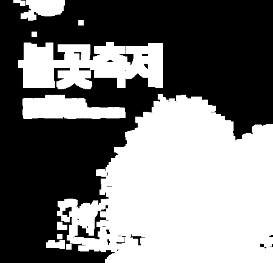
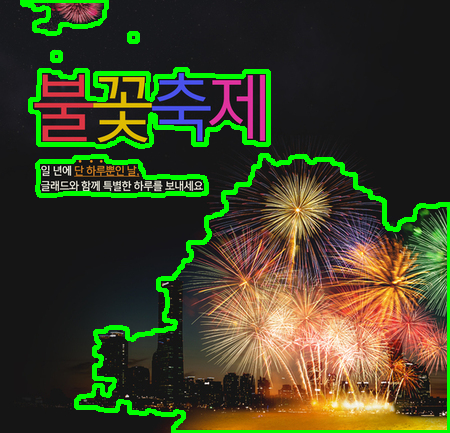

```{r setup, include=FALSE}
knitr::opts_chunk$set(echo = TRUE)
```

이 문서는 파이썬에서 OpenCV를 사용하여 다양한 이미지 안에 글자를 추출하는 방식을 구현해 보겠다. 자세한 스크립트는 [여기]()를 통해 확인하면 된다. 


### Example 1  

  
[이미지 출처](https://www.google.com/url?sa=i&url=http%3A%2F%2Fn894.ndsoftnews.com%2Fnews%2FarticleView.html%3Fidxno%3D89070&psig=AOvVaw2_ZML8M0NkPzVhbq_YTRRD&ust=1581909643517000&source=images&cd=vfe&ved=0CAIQjRxqFwoTCIiy7uWO1ecCFQAAAAAdAAAAABAN)  

이번 예제에서는 위 그림에 있는 단어들을 Tesseract 또는 Naver Clova OCR을 사용해서 추출 해보겠다.  

```{python, eval=FALSE}

import cv2
import numpy as np
import pandas as pd
import matplotlib.pyplot as plt

```

이제 이미지를 불러와서 Grayscale로 변경할 것이다. 위 그림은 3원색인 R(red), G(green), B(blue) 형태로 구성되어 있다. 그러나 이미지 처리를 할때 3원색을 가지고 하는것보다 1원색인 Grayscale로 변환하는게 편하다. 제이 간단한 방법은 3원색을 더해 3으로 나누어서 평균값을 사용해서 Grayscale 값을 구하는거다. OpenCV에서는 `cv2.RGB2GRAY`를 통해 바로 Grayscale 이미지를 추출할 수 있다.

```{python, eval=FALSE}

# Step 1: 이미지 원본
img_original = cv2.imread('pics/example.jpg')

# Step 2: Grayscale 변경
img_gray = cv2.cvtColor(img_original, cv2.COLOR_BGR2GRAY)

```


  

Grayscale 이미지는 0 ~ 255 까지의 색상값이 있다. 이미지 안에 텍스트를 추출하려면 나중에 coutring으로 추출한다. 그러기 위해서는 이미지를 흑백 이진화로 전환하는게 적절하다. 그 전에 임계값 (threshold)를 찾아야한다. 색상값이 임계값보다 작으면 검정색으로 변하고 임계값보다 높으면 흰색으로 변한다. 이것을 Global Threshold이라고도 한다.

이 문제에서 임계값은 색상의 분포를 보고 정하겠다.  

```{python, eval=FALSE}

# 이미지 색상값 분포
plt.hist(img_gray.ravel(), 256, [0, 256])
plt.show()


```

  

이미지 색상에서 주요 생상값은 50 이하로 이번 예제에서 임계값을 50으로 정하겠다. Global Threshold는 직접 임계값을 찾아야 하지만 Adaptive Threshold 방법을 사용하면 적합한 임계값을 찾아 변환한다. 이 방법은 다른 예제에서 사용해보겠다.

```{python, eval=FALSE}
_, thresh = cv2.threshold(img_gray, 50, 255, cv2.THRESH_BINARY)

```


위에 그림에 바로 contour를 추출하면 한 단어들이 여려개로 쪼개질 수 있다. 그래서 하얀색 픽셀값들을 한 덩어리로 뭉치게하면 contour로 쉽게 분리할 수 있다. 여기서는 Dilation을 한 후 Morph Close 방법을 사용하겠다. 이를 하기 위해 적절한 커널값이 필요하다. 자세한 내용은 곧 다른 문서에 자세히 작성하겠다.  

```{python, eval=FALSE}
# 커널 크기 
kernel = np.ones((5,5) ,np.uint8)

# Dilation 
dilation = cv2.dilate(thresh, kernel, iterations = 2)

```

  

```{python, eval=FALSE}
# Morph Close
closing = cv2.morphologyEx(dilation, cv2.MORPH_CLOSE, kernel)

```


비록 Morph Close와 Dilation 결과를 비교했을 때 크게 다르지는 않지만 Contour 추출을 위해 두가지 방법을 다 사용했다...  

<br>  

이제 Morph Close를 적용한 그림에 Contour를 적용하여 흰 픽셀이 뭉쳐있는 부분을 찾아내서 원본에다 그려보겠다.

```{python, eval=FALSE}

contours, hierarchy = cv2.findContours(closing, cv2.RETR_EXTERNAL, 3)

img_contour = cv2.drawContours(img_original, contours, -1, (0, 255, 0), 3)

```


