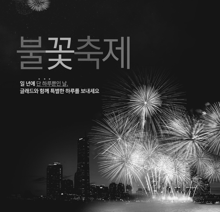
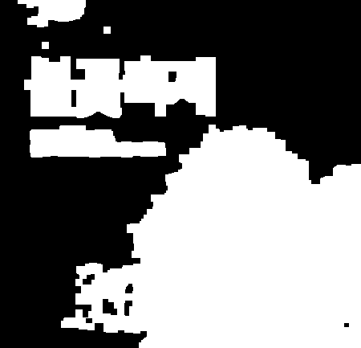

```{r setup, include=FALSE}
knitr::opts_chunk$set(echo = TRUE)
```

<style>
.col2 {
    columns: 2 200px;         /* number of columns and width in pixels*/
    -webkit-columns: 2 200px; /* chrome, safari */
    -moz-columns: 2 200px;    /* firefox */
  }
</style>


이 문서는 파이썬에서 OpenCV를 사용하여 다양한 이미지 안에 글자를 추출하는 방식을 구현해 보겠다. 자세한 스크립트는 [여기]()를 통해 확인하면 된다. 


### **Example 1**  

  
[이미지 출처](https://www.google.com/url?sa=i&url=http%3A%2F%2Fn894.ndsoftnews.com%2Fnews%2FarticleView.html%3Fidxno%3D89070&psig=AOvVaw2_ZML8M0NkPzVhbq_YTRRD&ust=1581909643517000&source=images&cd=vfe&ved=0CAIQjRxqFwoTCIiy7uWO1ecCFQAAAAAdAAAAABAN)  

이번 예제에서는 위 그림에 있는 단어들을 Tesseract 또는 Naver Clova OCR을 사용해서 추출 해보겠다.  

```{python, eval=FALSE}

import cv2
import numpy as np
import pandas as pd
import matplotlib.pyplot as plt

```

이제 이미지를 불러와서 Grayscale로 변경할 것이다. 위 그림은 3원색인 R(red), G(green), B(blue) 형태로 구성되어 있다. 그러나 이미지 처리를 할때 3원색을 가지고 하는것보다 1원색인 Grayscale로 변환하는게 편하다. 제이 간단한 방법은 3원색을 더해 3으로 나누어서 평균값을 사용해서 Grayscale 값을 구하는거다. OpenCV에서는 `cv2.RGB2GRAY`를 통해 바로 Grayscale 이미지를 추출할 수 있다.

```{python, eval=FALSE}

# Step 1: 이미지 원본
img_original = cv2.imread('pics/example.jpg')

# Step 2: Grayscale 변경
img_gray = cv2.cvtColor(img_original, cv2.COLOR_BGR2GRAY)

```


  

Grayscale 이미지는 0 ~ 255 까지의 색상값이 있다. 이미지 안에 텍스트를 추출하려면 나중에 coutring으로 추출한다. 그러기 위해서는 이미지를 흑백 이진화로 전환하는게 적절하다. 그 전에 임계값 (threshold)를 찾아야한다. 색상값이 임계값보다 작으면 검정색으로 변하고 임계값보다 높으면 흰색으로 변한다. 이것을 Global Threshold이라고도 한다.

이 문제에서 임계값은 색상의 분포를 보고 정하겠다.  

```{python, eval=FALSE}

# 이미지 색상값 분포
plt.hist(img_gray.ravel(), 256, [0, 256])
plt.show()


```

  

이미지 색상에서 주요 생상값은 50 이하로 이번 예제에서 임계값을 50으로 정하겠다. Global Threshold는 직접 임계값을 찾아야 하지만 Adaptive Threshold 방법을 사용하면 적합한 임계값을 찾아 변환한다. 이 방법은 다른 예제에서 사용해보겠다.

```{python, eval=FALSE}
_, thresh = cv2.threshold(img_gray, 50, 255, cv2.THRESH_BINARY)

```


위에 그림에 바로 contour를 추출하면 한 단어들이 여려개로 쪼개질 수 있다. 그래서 하얀색 픽셀값들을 한 덩어리로 뭉치게하면 contour로 쉽게 분리할 수 있다. 여기서는 Dilation을 한 후 Morph Close 방법을 사용하겠다. 이를 하기 위해 적절한 커널값이 필요하다. 자세한 내용은 곧 다른 문서에 자세히 작성하겠다.  

```{python, eval=FALSE}
# 커널 크기 
kernel = np.ones((5,5) ,np.uint8)

# Dilation 
dilation = cv2.dilate(thresh, kernel, iterations = 2)

```

  

```{python, eval=FALSE}
# Morph Close
closing = cv2.morphologyEx(dilation, cv2.MORPH_CLOSE, kernel)

```




비록 Morph Close와 Dilation 결과를 비교했을 때 크게 다르지는 않지만 Contour 추출을 위해 두가지 방법을 다 사용했다...  

<br>  

이제 Morph Close를 적용한 그림에 Contour를 적용하여 흰 픽셀이 뭉쳐있는 부분을 찾아내서 원본에다 그려보겠다.

```{python, eval=FALSE}

contours, hierarchy = cv2.findContours(closing, cv2.RETR_EXTERNAL, 3)

img_contour = cv2.drawContours(img_original, contours, -1, (0, 255, 0), 3)

```


원하는 부분에 Contour가 잘 적용되어 있다. 그런데 면적이 작은 부분이 있으므로 큰 부분만 추출해 보겠다.

```{python, eval=FALSE}
contour_pos = []

# 면적이 100 이하인 Contour 영역은 제거
for pos in range(len(contours)):
    area = cv2.contourArea(contours[pos])
    if area > 100:
        contour_pos.append(pos)

# 면적 부분 오려내기
for pos in contour_pos:
    x, y, w, h = cv2.boundingRect(contours[pos])
    img_crop = img_temp[y:y + h, x:x + w]

```


그런데 `사진 2`를 보면 `사진 1`에 포한된 부분이 있다. 만약 OCR 엔진에 돌리면 추출 될 텍스트가 중복될 수 있으므로 Contour 부분 외에는 다 검은색으로 변환해 보겠다. 다른 사진들은 잘 안보이겠지만... 자세히 보면 다르다... 

**사진 1**  

<div class="col2">
  

  

</div>  


**사진 2**  

<div class="col2">
  

  

</div>  

**사진 3**  

<div class="col2">
  

  

</div>  

**사진 4**  

<div class="col2">
  

  

</div>  

<br>  

이미지 왼쪽부터 Contour 영역 사이에 있는 픽셀값들을 구해 검은색으로 변환시켰다.

```{python, eval=FALSE}

for p in contour_pos:
    img_temp = cv2.imread('pics/example.jpg')
    img_orig = cv2.imread('pics/example.jpg')
    x, y, w, h = cv2.boundingRect(contours[p])

    cnt = contours[p]
    area = cv2.contourArea(cnt)

    area_box = w*h

    img_contour = cv2.drawContours(img_orig, contours, p, (0, 255, 0), 1)

    cnt = contours[p]
    M = cv2.moments(cnt)
    cx = int(M['m10']/M['m00'])
    cy = int(M['m01']/M['m00'])

    for i in range(y, y + h):
        px_lst = img_contour[i]

        for j in range(x, x + w):
            if (px_lst[j] == [0, 255, 0]).all():
                cv2.line(img_contour, (j, i), (cx, cy), (1, 2, 3), 2)


    img_crop = img_contour[y:y + h, x:x + w]

    for i in range(y, y + h):
        px_lst = img_contour[i]

        for j in range(x, x + w):
            if (px_lst[j] != [1, 2, 3]).all():
                cv2.line(img_temp, (j, i), (j, i), (0, 0, 0), 2)


    img_save = img_temp[y:y + h, x:x + w]
    
    cv2.imshow("Image", img_save)
    cv2.waitKey(0)
    cv2.destroyAllWindows()
    
```

<br>  

### 텍스트 추출  

여기서 나온 이미지들을 이제 Tesseract 또는 Clova OCR 엔진을 사용해서 추출하면 된다. 그러나 Tesseract은 이미지가 작으면 텍스트 추출이 잘 안될때가 많다. 그래서 Naver Clova OCR 엔진을 사용하는걸 추천한다. 

```{r load_required, echo=FALSE}
source("required.R")
```

```{r load_lib, message=FALSE}
library(httr)
library(jsonlite)
library(base64enc)
library(tidyverse)
library(magrittr)
```

[OCR](docs/ocr/ocr.html) 문서를 보면 Tesseract OCR이랑 Clova OCR 사용법에 대해 나와있다. 이 문서에 나온 Clova OCR 사용법을 `ocr_clova()`라는 함수로 만들었다. 현재 api 호출을 많이 한 상태라 글자가 있는 사진만 Clova OCR 엔진에 돌려보겠다.

```{r clova_call}
# 사진 1
ocr_clova(img_path='pics/crop_new37.png')

# 사진 3
ocr_clova(img_path='pics/crop_new30.png')

```

결과를 보면 사진에 있는 텍스트와 똑같이 나왔다. Clova OCR은 호출 한도를 넘기면 돈을 내야된다는것 빼고는 한국어 추출에는 매우 좋은 엔진이다. 지금은 직접 텍스트가 있는 사진을 골라 OCR에 돌렸지만 다음에는 딥러닝을 사용해서 이미지에 텍스트가 포함되었있는지 구분하고 OCR에 돌리는 예제를 만들어 보겠다.

